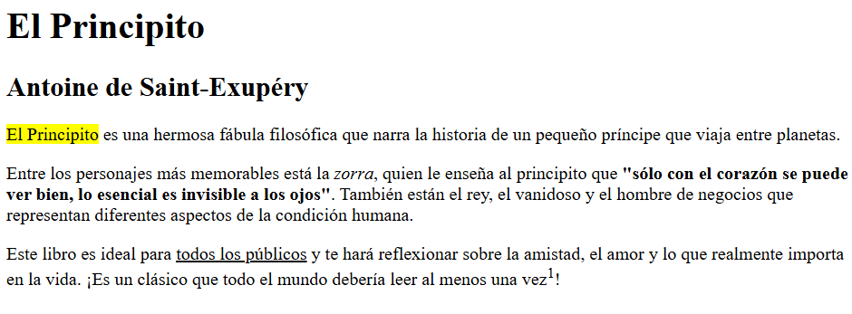

# Clase 1: Introducción a HTML - Fundamentos Básicos

## 📌 Objetivos de la Clase
- Entender qué es HTML y su importancia en el desarrollo web
- Aprender la estructura básica de un documento HTML
- Conocer las etiquetas esenciales para formato de texto
- Comprender el uso de encabezados y párrafos
- Crear tu primera página web con una biografía personal

## 🌐 ¿Qué es HTML?

HTML significa **HyperText Markup Language** (Lenguaje de Marcado de Hipertexto). No es un lenguaje de programación, sino un lenguaje de marcado que nos permite estructurar el contenido de una página web.

Imagina que HTML es como el esqueleto de un cuerpo humano: define la estructura y organización del contenido, pero no su apariencia. Más adelante, CSS será como la piel y la ropa que darán estilo a ese esqueleto.

La versión actual es **HTML5**, que incluye nuevas etiquetas semánticas que nos ayudan a crear estructuras más significativas y accesibles.

## 📄 Estructura básica de un documento HTML

```html
<!DOCTYPE html>
<html lang="es">
<head>
    <meta charset="UTF-8">
    <meta name="viewport" content="width=device-width, initial-scale=1.0">
    <title>Mi Primera Página Web</title>
</head>
<body>
    <!-- Aquí irá el contenido visible de la página -->
</body>
</html>
```

### Explicación de cada parte:
- `<!DOCTYPE html>`: Declara que este documento es HTML5
- `<html lang="es">`: Es el elemento raíz de la página. El atributo `lang` especifica el idioma
- `<head>`: Contiene metadatos e información sobre la página (no visible en el navegador)
- `<meta charset="UTF-8">`: Define la codificación de caracteres
- `<meta name="viewport" content="width=device-width, initial-scale=1.0">`: Hace que la página sea responsive
- `<title>`: El título de la página que aparece en la pestaña del navegador
- `<body>`: Aquí va todo el contenido visible de la página

## ✏️ Etiquetas esenciales para formato de texto

```html
<p>Este es un <b>párrafo</b> con texto en <strong>negrita</strong>.</p>
<p>Este texto está en <i>cursiva</i> y este en <em>énfasis</em>.</p>
<p>Este es un texto <u>subrayado</u> y este <s>tachado</s>.</p>
<p>Este es un <mark>texto resaltado</mark> como con marcador.</p>
<p>Subíndice: H<sub>2</sub>O - Superíndice: x<sup>2</sup></p>
```

### Etiquetas básicas para formato de texto:
- `<b>` y `<strong>`: Para texto en negrita. `<strong>` indica importancia semántica.
- `<i>` y `<em>`: Para texto en cursiva. `<em>` indica énfasis semántico.
- `<u>`: Para texto subrayado.
- `<s>`: Para texto tachado.
- `<mark>`: Para resaltar texto como con un marcador.
- `<sub>`: Para subíndices.
- `<sup>`: Para superíndices.

## 📑 Encabezados y párrafos

```html
<h1>Título Principal</h1>
<h2>Subtítulo</h2>
<h3>Sub-subtítulo</h3>
<p>Este es un párrafo de ejemplo. Los párrafos son esenciales para organizar el texto en bloques legibles.</p>
<p>Este es otro párrafo. Cada párrafo debe contener una idea principal.</p>
```

### Jerarquía de encabezados:
- `<h1>`: Es el título principal de la página (debe haber solo uno por página)
- `<h2>` a `<h6>`: Subtítulos, con `<h2>` siendo el más importante después de `<h1>`

Los encabezados son cruciales para:
- La estructura lógica de tu documento
- El SEO (posicionamiento en buscadores)
- La accesibilidad (ayudan a los lectores de pantalla)

Los párrafos se crean con `<p>`. Cada párrafo debe contener una idea completa y debe ir en su propia etiqueta `<p>`.

## 🏆 Ejercicio práctico: Crear una biografía personal

```html
<!DOCTYPE html>
<html lang="es">
<head>
    <meta charset="UTF-8">
    <meta name="viewport" content="width=device-width, initial-scale=1.0">
    <title>Mi Biografía</title>
</head>
<body>
    <h1>Mi Biografía Personal</h1>
    
    <h2>Sobre mí</h2>
    <p>Hola, me llamo <strong>Tu Nombre</strong> y soy de <em>Tu Ciudad</em>.</p>
    
    <h2>Mi educación</h2>
    <p>Estudié en <u>Nombre de tu escuela</u> y me gradué en <mark>Año</mark>.</p>
    
    <h2>Mis hobbies</h2>
    <p>Me gusta:</p>
    <ul>
        <li>Leer libros de tecnología</li>
        <li>Practicar deportes</li>
        <li>Desarrollar proyectos personales</li>
    </ul>
    
    <h2>Mi meta</h2>
    <p>Quiero convertirme en un desarrollador web experto para crear soluciones que ayuden a las personas. ¡Este es mi primer paso!</p>
</body>
</html>
```

### Pasos para completar el ejercicio:
1. Crea un nuevo archivo en tu editor de código y guárdalo como `biografia.html`
2. Copia la estructura básica de HTML que vimos
3. Dentro del `<body>`, agrega los encabezados y párrafos como se muestra
4. Personaliza con tu información real
5. Guarda el archivo y ábrelo en tu navegador

## 📎 Recurso adicional: Cheat Sheet de etiquetas HTML básicas

### Estructura básica:
```html
<!DOCTYPE html>
<html>
<head>
    <meta charset="UTF-8">
    <title>Título</title>
</head>
<body>
    Contenido
</body>
</html>
```

### Formato de texto:
- `<b>` - Negrita (presentación)
- `<strong>` - Negrita (semántica/importante)
- `<i>` - Cursiva (presentación)
- `<em>` - Cursiva (semántica/enfásis)
- `<u>` - Subrayado
- `<s>` - Tachado
- `<mark>` - Resaltado
- `<sub>` - Subíndice
- `<sup>` - Superíndice

### Encabezados y párrafos:
- `<h1>` a `<h6>` - Encabezados
- `<p>` - Párrafo

### Listas:
- `<ul>` - Lista no ordenada
- `<ol>` - Lista ordenada
- `<li>` - Elemento de lista

## 🏋️ Ejercicio de Refuerzo

Para practicar lo aprendido, aquí tienes un ejercicio adicional que puedes realizar:

```html
<!DOCTYPE html>
<html>
<head>
    <title>Ejercicio de Refuerzo</title>
</head>
<body>
    <h1>Mi Primer Ejercicio</h1>
    <p>Este es un texto con <b>negrita</b> y <i>cursiva</i>.</p>
    <p>Subíndice: H<sub>2</sub>O - Superíndice: x<sup>2</sup></p>
    <h2>Mi Lista de Metas</h2>
    <ul>
        <li>Aprender HTML</li>
        <li>Aprender CSS</li>
        <li>Crear mi portafolio</li>
    </ul>
</body>
</html>
```

**Instrucciones**: Crea un nuevo archivo llamado `ejercicio_refuerzo.html`, copia este código y personalízalo con tus propias metas y objetivos de aprendizaje.

## 🏆 Reto Adicional para la Clase 1: Página de Reseña de Libro

¡Felicidades por completar tu primera página web! Aquí tienes un **reto adicional** para que practiques aún más los fundamentos de HTML que aprendiste hoy:

### 📚 Descripción del Reto

Crea una página web que contenga una reseña de tu libro favorito. Debe incluir:

1. Un título principal (`<h1>`) con el nombre del libro
2. Un subtítulo (`<h2>`) con el nombre del autor
3. Al menos 3 párrafos (`<p>`) que describan:
   - Una breve sinopsis del libro
   - Tus personajes favoritos
   - Por qué recomendarías este libro
4. Usa al menos 5 etiquetas de formato diferentes:
   - `<b>` o `<strong>` para negrita
   - `<i>` o `<em>` para cursiva
   - `<u>` para subrayado
   - `<mark>` para resaltar texto
   - `<sup>` o `<sub>` para superíndice o subíndice

### 📌 Ejemplo de Cómo Debería quedar



### 💡 Consejos para Completar el Reto

- Comienza con la estructura básica de HTML que aprendiste
- Usa tus propios libros favoritos para hacer el ejercicio más personal
- Experimenta con diferentes combinaciones de etiquetas de formato
- Abre tu archivo en el navegador para ver cómo se ve el resultado
- Si quieres, añade una lista de tus 3 lecciones favoritas del libro usando `<ul>` y `<li>`

### 📅 Entrega

¡Tómate el tiempo que necesites!.

¿Te animas a aceptar el reto? ¡Tu página web de reseña de libro podría ser el inicio de tu carrera como desarrollador web! 🚀
