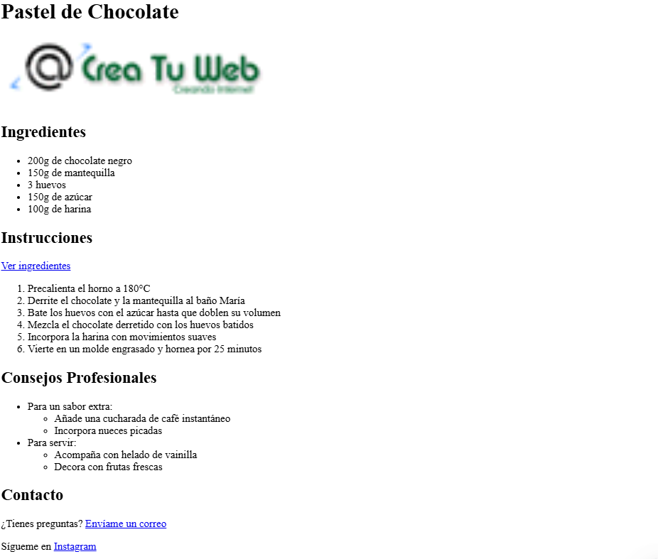

# Clase 2: Enlaces, Imágenes y Listas en HTML

## 📌 Objetivos de la Clase
- Aprender a crear enlaces internos y externos
- Insertar y configurar imágenes en una página web
- Crear listas ordenadas y desordenadas
- Comprender cómo anidar listas para estructuras complejas
- Aplicar buenas prácticas en la creación de contenido estructurado

## 🔗 Enlaces en HTML

Los enlaces son esenciales para la navegación en la web. Se crean con la etiqueta `<a>` (anchor) y el atributo `href` que especifica la URL de destino.

```html
<a href="https://www.academiafibonacci.com.gt">Visita Academia Fibonacci</a>
```

### Tipos de enlaces:

#### 1. Enlaces externos:
```html
<a href="https://www.google.com" target="_blank">Google</a>
```
> `target="_blank"` abre el enlace en una nueva pestaña

#### 2. Enlaces internos:
```html
<a href="pagina-interna.html">Página interna</a>
```

#### 3. Enlaces de anclaje:
```html
<a href="#seccion-contacto">Ir a contacto</a>
<!-- Más adelante en la página -->
<h2 id="seccion-contacto">Contacto</h2>
```

#### 4. Enlaces de correo:
```html
<a href="mailto:info@academiafibonacci.com.gt">Enviar correo</a>
```

### Buenas prácticas:
- Siempre usa `target="_blank"` para enlaces externos
- Proporciona texto descriptivo (evita "haga clic aquí")
- Usa el atributo `title` para descripciones adicionales
- Para enlaces que abren en nueva pestaña, añade un icono o texto indicando esto

## 🖼️ Imágenes en HTML

Las imágenes se insertan con la etiqueta ``, que es una etiqueta autocontenida (no necesita cierre).

```html

```

### Atributos importantes:
- `src`: Ruta de la imagen (obligatorio)
- `alt`: Texto alternativo (obligatorio para accesibilidad)
- `width/height`: Dimensiones de la imagen
- `title`: Texto que aparece al pasar el mouse

```html

```

### Tipos de rutas:

#### 1. Ruta absoluta:
```html

```

#### 2. Ruta relativa:
```html
<!-- Imagen en la misma carpeta -->


<!-- Imagen en subcarpeta "imagenes" -->

```

### Buenas prácticas:
- Siempre incluye el atributo `alt` para accesibilidad y SEO
- Optimiza el tamaño de las imágenes para mejorar el rendimiento
- Usa formatos adecuados (JPEG para fotos, PNG para gráficos con transparencia)
- Considera usar el atributo `loading="lazy"` para imágenes fuera de la vista inicial

## 📋 Listas en HTML

### Listas desordenadas (`<ul>`)
Se utilizan cuando el orden de los elementos no es importante:

```html
<ul>
    <li>Primer elemento</li>
    <li>Segundo elemento</li>
    <li>Tercer elemento</li>
</ul>
```

### Listas ordenadas (`<ol>`)
Se utilizan cuando el orden de los elementos es importante:

```html
<ol>
    <li>Paso uno</li>
    <li>Paso dos</li>
    <li>Paso tres</li>
</ol>
```

### Personalización de listas:

#### Cambiar el tipo de viñeta:
```html
<ul style="list-style-type: square;">
    <li>Cuadrado</li>
</ul>
```

#### Cambiar el tipo de numeración:
```html
<ol type="A">
    <li>Letra A</li>
    <li>Letra B</li>
</ol>
```

## 🌐 Listas anidadas

Las listas pueden contener otras listas para crear estructuras jerárquicas:

```html
<ul>
    <li>Frutas
        <ul>
            <li>Manzana</li>
            <li>Plátano</li>
            <li>Naranja</li>
        </ul>
    </li>
    <li>Verduras
        <ul>
            <li>Zanahoria</li>
            <li>Espárrago</li>
        </ul>
    </li>
</ul>
```

### Ejemplo práctico: Menú de navegación
```html
<nav>
    <ul>
        <li><a href="index.html">Inicio</a></li>
        <li><a href="#">Cursos
            <ul>
                <li><a href="html-css.html">HTML y CSS</a></li>
                <li><a href="javascript.html">JavaScript</a></li>
                <li><a href="python.html">Python</a></li>
            </ul>
        </li>
        <li><a href="contacto.html">Contacto</a></li>
    </ul>
</nav>
```

## 🏆 Ejercicio práctico: Crear una página de menú de restaurante

```html
<!DOCTYPE html>
<html lang="es">
<head>
    <meta charset="UTF-8">
    <meta name="viewport" content="width=device-width, initial-scale=1.0">
    <title>Menú de Restaurante</title>
</head>
<body>
    <h1>Menú del Restaurante</h1>
    
    <h2>Entradas</h2>
    <ul>
        <li>Ensalada César - Q25.00</li>
        <li>Sopa del día - Q20.00</li>
        <li>Queso fundido - Q35.00</li>
    </ul>
    
    <h2>Platos principales</h2>
    <ol>
        <li>Filete de res - Q85.00
            <ul>
                <li>Acompañamientos: Papas fritas, ensalada</li>
            </ul>
        </li>
        <li>Pasta Alfredo - Q65.00
            <ul>
                <li>Opciones: Pollo, camarones, vegetales</li>
            </ul>
        </li>
        <li>Pizza familiar - Q75.00
            <ul>
                <li>Tamaños: Mediana, Grande</li>
                <li>Ingredientes: Pepperoni, jamón, champiñones</li>
            </ul>
        </li>
    </ol>
    
    <h2>Bebidas</h2>
    <ul>
        <li>Agua - Q10.00</li>
        <li>Gaseosa - Q15.00</li>
        <li>Vino tinto/blanco - Q60.00</li>
    </ul>
    
    <h2>Contacto</h2>
    <p>Visítanos en: <a href="https://maps.google.com" target="_blank">Nuestra ubicación</a></p>
    <p>Llámanos: <a href="tel:+50247660639">4766 0639</a></p>
</body>
</html>
```

### Pasos para completar el ejercicio:
1. Crea un nuevo archivo en tu editor de código y guárdalo como `menu-restaurant.html`
2. Copia la estructura básica de HTML
3. Agrega las secciones del menú usando listas adecuadas
4. Incluye imágenes de algunos platos (puedes usar imágenes de placeholder como `https://via.placeholder.com/150`)
5. Agrega enlaces de contacto
6. Personaliza con tu información real
7. Guarda el archivo y ábrelo en tu navegador

## 📎 Cheat Sheet de enlaces, imágenes y listas

### Enlaces:
- `<a href="url">Texto</a>` - Enlace básico
- `target="_blank"` - Abre en nueva pestaña
- `mailto:email` - Enlace de correo
- `#id` - Enlace de anclaje

### Imágenes:
- `` - Sintaxis básica
- `width` y `height` - Dimensiones
- `loading="lazy"` - Carga diferida

### Listas:
- `<ul>` - Lista desordenada
- `<ol>` - Lista ordenada
- `<li>` - Elemento de lista
- `type="A"` - Tipo de numeración
- `style="list-style-type: square"` - Tipo de viñeta

## 🏆 Reto Adicional: Página de Recetas de Cocina

### 📚 Descripción del Reto
Crea una página web que contenga una receta de cocina detallada. Debe incluir:

- Un título principal (`<h1>`) con el nombre de la receta
- Una imagen de la receta (usa `img` con atributos adecuados)
- Secciones organizadas con:
  - **Ingredientes**: En una lista desordenada (`<ul>`)
  - **Instrucciones**: En una lista ordenada (`<ol>`)
  - **Consejos**: En una lista anidada dentro de otra sección
- Enlaces útiles:
  - Un enlace a tu sitio web o redes sociales
  - Un enlace de correo para preguntas
  - Un enlace de anclaje a la sección de ingredientes desde las instrucciones

### 📌 Ejemplo de Cómo Debería Verse



### 💡 Consejos para Completar el Reto
- Usa una imagen de placeholder si no tienes una imagen real: `https://via.placeholder.com/400x300`
- Organiza tu código con sangría para que sea más legible
- Prueba diferentes estilos de listas (viñetas y numeración)
- Asegúrate de que todos los enlaces funcionen correctamente
- Incluye el atributo `alt` en tu imagen para accesibilidad

### 📅 Entrega
¡Tómate el tiempo que necesites! Cuando termines, comparte tu código en el grupo de WhatsApp y te daré feedback personalizado.

**Bonus**: Si completas este reto, ¡recibirás un cheat sheet avanzado con más técnicas de HTML que aprenderemos en la próxima clase!

¿Te animas a aceptar el reto? ¡Tu página web de recetas podría ser el inicio de tu blog de cocina! 🍫🍰
