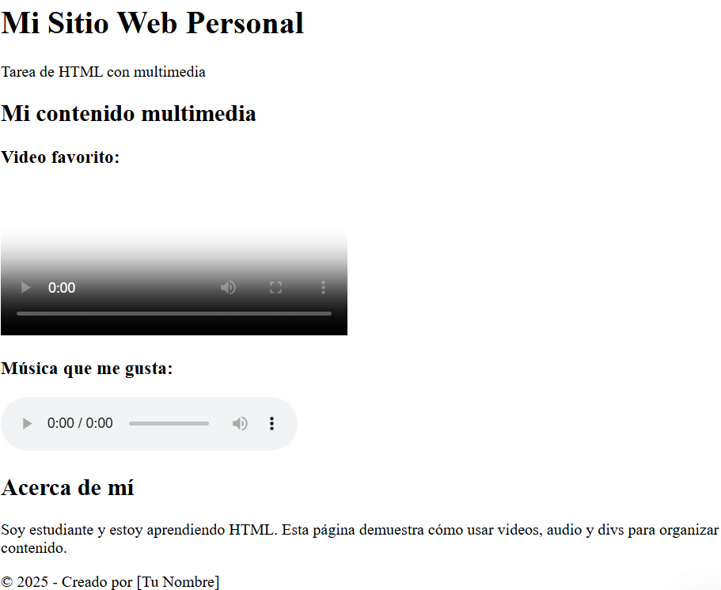

# Clase 3: Multimedia y Estructura con Divs

## 📌 Objetivos de la Clase
- Aprender a integrar elementos multimedia (audio y video) en una página web
- Entender los atributos esenciales para controlar el comportamiento de multimedia
- Dominar el uso del elemento `<div>` como contenedor principal
- Aprender a estructurar contenido con divs semánticos
- Crear una sección de multimedia funcional para un blog

## 🎧 Integración de Audio en HTML

El elemento `<audio>` se utiliza para reproducir archivos de audio en una página web.

```html
<audio controls>
    <source src="audio/ejemplo.mp3" type="audio/mpeg">
    Tu navegador no soporta el elemento de audio.
</audio>
```

### Atributos esenciales:
- **controls**: Muestra controles para reproducir, pausar y ajustar el volumen
- **autoplay**: Hace que el audio se reproduzca automáticamente al cargarse la página
- **loop**: Hace que el contenido se reproduzca en bucle
- **muted**: Silencia el audio inicialmente

### Formatos compatibles:
- **MP3 (audio/mpeg)**: Ampliamente compatible con la mayoría de navegadores
- **WAV (audio/wav)**: Calidad sin compresión, pero archivos grandes
- **OGG (audio/ogg)**: Formato abierto, compatible con la mayoría de navegadores modernos

### Ejemplo avanzado:
```html
<audio controls autoplay loop>
    <source src="musica.mp3" type="audio/mpeg">
    <source src="musica.ogg" type="audio/ogg">
    Tu navegador no soporta el elemento de audio.
</audio>
```

## 🎥 Integración de Video en HTML

El elemento `<video>` se utiliza para reproducir archivos de video en una página web.

```html
<video controls width="600">
    <source src="video/ejemplo.mp4" type="video/mp4">
    Tu navegador no soporta el elemento de video.
</video>
```

### Atributos esenciales:
- **controls**: Muestra controles para reproducir, pausar y ajustar el volumen
- **width/height**: Define el tamaño del video
- **autoplay**: Reproduce el video automáticamente al cargarse la página
- **loop**: Hace que el video se reproduzca en bucle
- **poster**: Especifica una imagen que se muestra mientras se carga el video
- **muted**: Silencia el video inicialmente

### Formatos compatibles:
- **MP4 (video/mp4)**: Ampliamente compatible (usando codec H.264)
- **WebM (video/webm)**: Formato abierto, compatible con navegadores modernos
- **OGG (video/ogg)**: Menos común pero compatible con algunos navegadores

### Ejemplo avanzado:
```html
<video controls width="800" height="450" poster="portada.jpg">
    <source src="video.mp4" type="video/mp4">
    <source src="video.webm" type="video/webm">
    Tu navegador no soporta el elemento de video.
</video>
```

## 📦 Elemento `<div>` en HTML

El elemento `<div>` es un contenedor genérico en HTML que se utiliza para agrupar otros elementos y aplicarles estilos o scripts. No tiene un significado específico por sí mismo, pero es muy útil para la estructura y el diseño de las páginas web.

```html
<div class="contenedor-principal">
    <h1>Título de la sección</h1>
    <p>Este es un párrafo dentro de un div.</p>
</div>
```

### Buenas prácticas con `<div>`:
- Nunca usar divs cuando exista una etiqueta semántica más apropiada (como `<header>`, `<footer>`, `<article>`, etc.)
- Siempre añadir clases o IDs descriptivos para facilitar el estilizado
- Evitar anidar demasiados divs (máximo 3-4 niveles de profundidad)
- Mantener la estructura organizada con comentarios HTML

### Ejemplo de estructura con divs:
```html
<div class="blog-post">
    <div class="post-header">
        <h2>Título del Artículo</h2>
        <p class="post-date">Publicado el 15 de mayo de 2024</p>
    </div>
    
    <div class="post-content">
        <p>Contenido del artículo...</p>
        <div class="multimedia">
            <video controls width="100%">
                <source src="video.mp4" type="video/mp4">
                Tu navegador no soporta el elemento de video.
            </video>
        </div>
    </div>
    
    <div class="post-footer">
        <p>Categorías: <a href="#">Tecnología</a>, <a href="#">Web</a></p>
    </div>
</div>
```

## 🌐 Estructurar contenido con divs semánticos

Aunque HTML5 introdujo etiquetas semánticas (`<header>`, `<footer>`, `<article>`, etc.), los `<div>` siguen siendo esenciales para agrupar contenido. La clave está en usarlos de manera inteligente:

### Estructura básica de una página:
```html
<div class="wrapper">
    <div class="header">
        <h1>Mi Sitio Web</h1>
    </div>
    
    <div class="nav">
        <ul>
            <li><a href="#">Inicio</a></li>
            <li><a href="#">Blog</a></li>
            <li><a href="#">Contacto</a></li>
        </ul>
    </div>
    
    <div class="content">
        <div class="main">
            <h2>Contenido Principal</h2>
            <!-- Aquí iría el contenido principal -->
        </div>
        
        <div class="sidebar">
            <h3>Lateral</h3>
            <!-- Aquí iría el contenido lateral -->
        </div>
    </div>
    
    <div class="footer">
        <p>&copy; 2024 Mi Sitio Web</p>
    </div>
</div>
```

### Consejos para estructurar con divs:
- Usar clases descriptivas que indiquen el propósito del div
- Mantener una jerarquía clara con sangría adecuada en el código
- Agregar comentarios para secciones importantes
- Evitar divitis (exceso de divs sin necesidad)

## 🏆 Ejercicio práctico: Crear una sección de multimedia para un blog

```html
<!DOCTYPE html>
<html lang="es">
<head>
    <meta charset="UTF-8">
    <title>Mi Sitio Web - Tarea HTML</title>
</head>
<body>
    <!-- Contenedor general -->
    <div class="sitio-web">
        
        <!-- Encabezado -->
        <div class="encabezado">
            <h1>Mi Sitio Web Personal</h1>
            <p>Tarea de HTML con multimedia</p>
        </div>
        
        <!-- Contenido principal -->
        <div class="contenido-principal">
            
            <!-- Sección multimedia -->
            <div class="multimedia-seccion">
                <h2>Mi contenido multimedia</h2>
                
                <h3>Video favorito:</h3>
                <video controls width="350" poster="portada.jpg">
                    <source src="mi-video.mp4" type="video/mp4">
                    <source src="mi-video.webm" type="video/webm">
                    Tu navegador no soporta video.
                </video>
                
                <h3>Música que me gusta:</h3>
                <audio controls>
                    <source src="cancion-favorita.mp3" type="audio/mpeg">
                    <source src="cancion-favorita.ogg" type="audio/ogg">
                    Tu navegador no soporta audio.
                </audio>
            </div>
            
            <!-- Información personal -->
            <div class="info-personal">
                <h2>Acerca de mí</h2>
                <p>Soy estudiante y estoy aprendiendo HTML. Esta página demuestra cómo usar videos, audio y divs para organizar contenido.</p>
            </div>
            
        </div>
        
        <!-- Pie de página -->
        <div class="pie">
            <p>© 2025 - Creado por [Tu Nombre]</p>
        </div>
        
    </div>
</body>
</html>
```

### Pasos para completar el ejercicio:
1. Crea un nuevo archivo en tu editor de código y guárdalo como `seccion-multimedia.html`
2. Copia la estructura básica de HTML
3. Agrega las secciones de audio y video usando los elementos `<audio>` y `<video>`
4. Si no tienes archivos de audio/video reales, usa estos enlaces de ejemplo:
   - **Audio**: https://www.soundhelix.com/examples/mp3/SoundHelix-Song-1.mp3
   - **Video**: https://storage.googleapis.com/gtv-videos-bucket/sample/BigBuckBunny.mp4
   - **Poster**: https://via.placeholder.com/800x450
5. Personaliza los estilos con CSS
6. Guarda el archivo y ábrelo en tu navegador

## 📎 Recurso adicional: Formatos compatibles y mejores prácticas

### Formatos de audio compatibles:
| Formato | Tipo MIME | Compatibilidad |
|---------|-----------|----------------|
| MP3 | audio/mpeg | Excelente (todos los navegadores) |
| WAV | audio/wav | Bueno |
| OGG | audio/ogg | Bueno (excepto en Safari) |

### Formatos de video compatibles:
| Formato | Tipo MIME | Compatibilidad |
|---------|-----------|----------------|
| MP4 (H.264) | video/mp4 | Excelente (todos los navegadores) |
| WebM | video/webm | Bueno (excepto en Safari) |
| OGG | video/ogg | Limitado |

### Mejores prácticas:
- Siempre proporciona múltiples formatos para máxima compatibilidad
- Usa el atributo `poster` en videos para una mejor experiencia de usuario
- Evita `autoplay` con sonido (los navegadores modernos lo bloquean)
- Optimiza el tamaño de los archivos para mejorar el tiempo de carga
- Incluye texto alternativo para usuarios con discapacidad

## 🏆 Reto Adicional: Galería Multimedia de Viajes

¡Felicidades por completar los ejercicios de multimedia y divs! Aquí tienes un reto adicional para que practiques aún más:

### 📚 Descripción del Reto
Crea una página web que simule una galería multimedia de viajes. Debe incluir:

- Un diseño organizado con divs semánticos
- Sección de audio con al menos 2 pistas de sonido de diferentes ubicaciones
- Sección de video con al menos 1 video (usa el atributo `poster`)
- Uso de múltiples formatos para compatibilidad (MP3/OGG para audio, MP4/WebM para video)
- Una galería de imágenes relacionadas con los videos y audios
- Navegación interna para moverse entre secciones

### 📌 Ejemplo de Cómo Debería Verse



### 💡 Consejos para Completar el Reto
- Usa enlaces de placeholder para audio y video si no tienes archivos propios
- Organiza tu código con comentarios para cada sección
- Aplica estilos consistentes usando clases
- Usa el atributo `poster` en tus videos para una mejor experiencia
- Implementa navegación interna con anclas (`#id`)
- Prueba tu página en diferentes navegadores para verificar compatibilidad

### 📅 Entrega
¡Tómate el tiempo que necesites!.

¿Te animas a aceptar el reto? ¡Tu galería multimedia podría ser el inicio de tu portfolio como desarrollador web! 🌍🎧🎥
