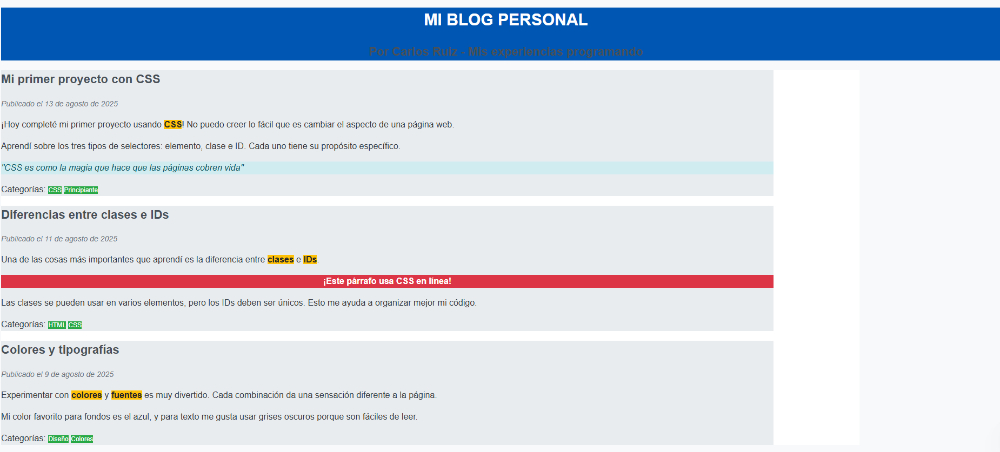
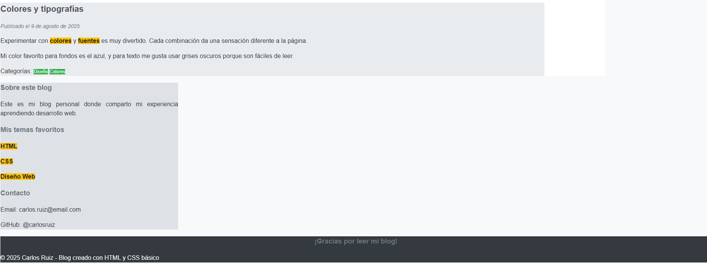

# Clase 4: Aplicando CSS - Estilos Básicos y Selectores

## 📌 Objetivos de la Clase
- Aprender las tres formas de aplicar estilos CSS (en línea, interno y externo)
- Dominar selectores básicos (elemento, clase, id) para aplicar estilos
- Conocer propiedades esenciales para dar estilo al texto y fondos
- Aprender la sintaxis correcta y buenas prácticas en CSS
- Crear tu primera hoja de estilos para dar estilo a la biografía del Video 1
- Organizar tu archivo CSS para proyectos grandes

## 🎨 ¿Qué es CSS?

CSS significa **Cascading Style Sheets** (Hojas de Estilo en Cascada). Es el lenguaje que utilizamos para describir la presentación de un documento escrito en HTML.

Mientras que HTML define la estructura y contenido de una página web (como el esqueleto del cuerpo humano), CSS define cómo se ve ese contenido (como la piel, la ropa y el estilo del cuerpo).

### Ventajas de usar CSS:
- **Separación de contenido y presentación**: El HTML se enfoca en la estructura, CSS en el diseño
- **Consistencia**: Establece un estilo uniforme en todas las páginas
- **Mantenimiento**: Cambia el diseño de todo el sitio modificando un solo archivo
- **Rendimiento**: Los navegadores cachean los archivos CSS, acelerando la carga de páginas

## 📁 Tres formas de aplicar CSS

### 1. CSS en línea (inline)
Se aplica directamente en el atributo `style` de un elemento HTML.

```html
<p style="color: blue; font-size: 18px;">Este es un párrafo con estilo en línea</p>
```

**Cuándo usarlo**: Para estilos muy específicos y excepcionales (no recomendado para uso general).

### 2. CSS interno (embedded)
Se define dentro de la etiqueta `<style>` en la sección `<head>` del documento.

```html
<!DOCTYPE html>
<html lang="es">
<head>
    <meta charset="UTF-8">
    <title>CSS Interno</title>
    <style>
        body {
            background-color: #f0f0f0;
            font-family: Arial, sans-serif;
        }
        h1 {
            color: #333;
            text-align: center;
        }
        p {
            color: #666;
            line-height: 1.5;
        }
    </style>
</head>
<body>
    <h1>Título Principal</h1>
    <p>Párrafo con estilo interno</p>
</body>
</html>
```

**Cuándo usarlo**: Para estilos específicos de una sola página.

### 3. CSS externo
El método recomendado para la mayoría de los proyectos. Los estilos se definen en un archivo separado con extensión `.css`.

**Archivo styles.css:**
```css
body {
    background-color: #f0f0f0;
    font-family: Arial, sans-serif;
    margin: 0;
    padding: 0;
}

h1 {
    color: #333;
    text-align: center;
    padding: 20px;
}

p {
    color: #666;
    line-height: 1.5;
    padding: 0 20px;
}
```

**Archivo HTML:**
```html
<!DOCTYPE html>
<html lang="es">
<head>
    <meta charset="UTF-8">
    <title>CSS Externo</title>
    <link rel="stylesheet" href="styles.css">
</head>
<body>
    <h1>Título Principal</h1>
    <p>Párrafo con estilo externo</p>
</body>
</html>
```

#### Ventajas del CSS externo:
- Separa completamente estructura y presentación
- Permite mantener un estilo consistente en todo el sitio
- Los navegadores cachean el archivo CSS, mejorando el rendimiento
- Facilita los cambios globales (modificas un archivo y se actualiza todo el sitio)

## 🧩 Sintaxis y selectores básicos de CSS

### Sintaxis básica
```css
selector {
    propiedad: valor;
    /* Más propiedades */
}
```

### Selectores comunes

#### 1. Selector de elemento:
```css
/* Aplica a todas las etiquetas p */
p {
    color: #333;
    font-size: 16px;
}
```

#### 2. Selector de clase:
```css
/* Aplica a cualquier elemento con class="texto-destacado" */
.texto-destacado {
    background-color: yellow;
    font-weight: bold;
}
```

```html
<p class="texto-destacado">Este texto está destacado</p>
```

#### 3. Selector de ID:
```css
/* Aplica al elemento con id="cabecera" */
#cabecera {
    text-align: center;
    padding: 20px;
}
```

```html
<div id="cabecera">Contenido de la cabecera</div>
```

### Reglas importantes sobre selectores:
- Las clases pueden usarse en múltiples elementos
- Los IDs deben ser únicos en toda la página
- Puedes combinar selectores: `h1, h2, h3 { color: blue; }`
- Los selectores de clase e ID pueden usarse con elementos: `p.texto-destacado { ... }`


## 📋 Sintaxis correcta y buenas prácticas

### Sintaxis correcta:
- Siempre usa punto y coma después de cada declaración
- Organiza por grupos lógicos (reset, variables, elementos base, secciones)
- Usa comentarios para dividir secciones
- Mantén una indentación consistente

```css
/* ==============================
   RESET
   ============================== */
* {
    margin: 0;
    padding: 0;
    box-sizing: border-box;
}

/* ==============================
   VARIABLES
   ============================== */
:root {
    --color-primary: #3498db;
    --color-secondary: #2c3e50;
    --color-accent: #e74c3c;
    --font-main: 'Arial', sans-serif;
}

/* ==============================
   ELEMENTOS BASE
   ============================== */
body {
    font-family: var(--font-main);
    line-height: 1.6;
    color: var(--color-secondary);
    background-color: #f8f9fa;
    padding: 20px;
}

h1, h2, h3, h4, h5, h6 {
    margin-bottom: 15px;
    color: var(--color-secondary);
}

p {
    margin-bottom: 20px;
}

a {
    color: var(--color-primary);
    text-decoration: none;
}

a:hover {
    text-decoration: underline;
}
```

### Buenas prácticas:
- Usa variables CSS para colores y fuentes comunes
- Evita el uso excesivo de `!important`
- Usa clases descriptivas (evita nombres como "rojo", "grande")
- Organiza tu CSS en secciones lógicas
- Mantén tu código limpio con comentarios y formato consistente
- Usa el modelo `box-sizing: border-box` para simplificar el cálculo de tamaños

## 🏆 Ejercicio práctico: Portafolio básico


### Pasos para completar el ejercicio:

1. Crea un archivo llamado `styles.css` en la misma carpeta que tu `biografia.html`

2. Vincula el CSS en el `<head>` de tu HTML:
```html
<link rel="stylesheet" href="styles.css">
```

3. Agrega los siguientes estilos a tu archivo CSS:

```css

   
        /* Selectores de elemento */
        body {
            background-color: #ecf0f1;
            font-family: Arial, sans-serif;
            color: #2c3e50;
            line-height: 1.6;
        }
        
        h1 {
            color: white;
            text-align: center;
            font-size: 32px;
            text-transform: uppercase;
        }
        
        h2 {
            color: #34495e;
            font-size: 24px;
            text-align: center;
        }
        
        h3 {
            color: #7f8c8d;
            font-size: 18px;
        }
        
        p {
            font-size: 16px;
            text-align: justify;
        }
        
        /* Selectores de clase */
        .banner-principal {
            background-color: #9b59b6;
            color: white;
            text-align: center;
        }
        
        .seccion-contenido {
            background-color: white;
            width: 80%;
        }
        
        .habilidad-destacada {
            background-color: #f39c12;
            color: white;
            font-weight: bold;
        }
        
        .texto-importante {
            color: #e74c3c;
            font-weight: bold;
            font-size: 18px;
        }
        
        .proyecto-item {
            background-color: #bdc3c7;
            width: 70%;
        }
        
        .contacto-info {
            background-color: #95a5a6;
            color: white;
            text-align: center;
        }
        
        /* Selectores de ID */
        #encabezado {
            background-color: #8e44ad;
            color: white;
        }
        
        #sobre-mi {
            background-color: #3498db;
            color: white;
        }
        
        #footer {
            background-color: #2c3e50;
            color: white;
            text-align: center;
        }
    
        
```

```html

<!DOCTYPE html>
<html lang="es">
<head>
    <meta charset="UTF-8">
    <title>Portafolio - Ana López</title>
    <link rel="stylesheet" href="styles.css">


</head>
<body>
    
    <!-- Encabezado principal -->
    <div id="encabezado" class="banner-principal">
        <h1>Ana López</h1>
        <h2>Desarrolladora Web Junior</h2>
    </div>
    
    <!-- Sección Sobre mí -->
    <div id="sobre-mi">
        <h2>Sobre mí</h2>
        <p>¡Hola! Soy Ana y estoy comenzando mi carrera como desarrolladora web. Me apasiona crear sitios web funcionales y atractivos.</p>
    </div>
    
    <!-- Contenido principal -->
    <div class="seccion-contenido">
        
        <h2>Mis Habilidades</h2>
        <p>Actualmente estoy aprendiendo las siguientes tecnologías:</p>
        
        <h3>Lenguajes que manejo:</h3>
        <p><span class="habilidad-destacada">HTML5</span> - Estructura de páginas web</p>
        <p><span class="habilidad-destacada">CSS3</span> - Diseño y estilos</p>
        
        <!-- CSS en línea -->
        <p style="background-color: #1abc9c; color: white; font-size: 20px; text-align: center;">¡Próximamente JavaScript!</p>
        
        <h2>Mis Proyectos</h2>
        <p class="texto-importante">Estos son algunos proyectos que he realizado:</p>
        
        <div class="proyecto-item">
            <h3>Proyecto 1: Mi primera página web</h3>
            <p>Una página personal creada solo con HTML</p>
        </div>
        
        <div class="proyecto-item">
            <h3>Proyecto 2: Blog con estilos</h3>
            <p>Un blog personal usando HTML y CSS básico</p>
        </div>
        
        <div class="proyecto-item">
            <h3>Proyecto 3: Portafolio</h3>
            <p>Este mismo portafolio que estás viendo</p>
        </div>
        
    </div>
    
    <!-- Información de contacto -->
    <div class="contacto-info">
        <h2>Contacto</h2>
        <p>Email: ana.lopez@email.com</p>
        <p>Teléfono: (555) 123-4567</p>
    </div>
    
    <!-- Pie de página -->
    <div id="footer">
        <h3>¡Gracias por visitar mi portafolio!</h3>
        <p>Creado con HTML y CSS - 2025</p>
    </div>
    
</body>
</html>
```

4. Personaliza los colores y estilos según tus preferencias
5. ¡Prueba diferentes combinaciones de colores y tipografías!

## 📎 Recurso adicional: Cheat Sheet de CSS básico

### Sintaxis básica:
```css
selector {
    propiedad: valor;
}
```

### Selectores:
- `p` - Selector de elemento
- `.clase` - Selector de clase
- `#id` - Selector de ID
- `h1, h2, h3` - Selector múltiple
- `p span` - Selector descendiente

### Propiedades de texto:
- `color` - Color del texto
- `font-family` - Tipo de letra
- `font-size` - Tamaño de fuente
- `font-weight` - Grosor de la fuente
- `text-align` - Alineación del texto
- `line-height` - Altura de línea

### Propiedades de color:
- `color: red;` - Por nombre
- `color: #ff0000;` - Hexadecimal
- `color: rgb(255, 0, 0);` - RGB
- `color: rgba(255, 0, 0, 0.5);` - RGBA (con transparencia)

### Propiedades de fondo:
- `background-color` - Color de fondo
- `background-image` - Imagen de fondo
- `background-repeat` - Repetición del fondo
- `background-position` - Posición del fondo
- `background-size` - Tamaño del fondo

## 📌 Consejo: Organizar tu archivo CSS para proyectos grandes

Cuando trabajas en proyectos grandes, es crucial mantener tu CSS organizado para facilitar el mantenimiento y colaboración. Aquí te comparto un esquema efectivo:

### Estructura recomendada para CSS en proyectos grandes:

```css
/* ==============================
   1. RESET Y NORMALIZACIÓN
   ============================== */
* {
    margin: 0;
    padding: 0;
    box-sizing: border-box;
}

/* ==============================
   2. VARIABLES CSS (THEME)
   ============================== */
:root {
    /* Colores */
    --primary-color: #3498db;
    --secondary-color: #2c3e50;
    --accent-color: #e74c3c;
    --light-color: #ecf0f1;
    --dark-color: #2c3e50;
    
    /* Tipografía */
    --font-main: 'Arial', sans-serif;
    --font-heading: 'Georgia', serif;
    --font-size-base: 16px;
    --line-height: 1.6;
    
    /* Espaciado */
    --spacing-xs: 0.5rem;
    --spacing-sm: 1rem;
    --spacing-md: 1.5rem;
    --spacing-lg: 2rem;
    --spacing-xl: 3rem;
}

/* ==============================
   3. ELEMENTOS BASE
   ============================== */
body {
    font-family: var(--font-main);
    font-size: var(--font-size-base);
    line-height: var(--line-height);
    color: var(--dark-color);
    background-color: var(--light-color);
}

h1, h2, h3, h4, h5, h6 {
    margin-bottom: var(--spacing-sm);
    color: var(--secondary-color);
    line-height: 1.2;
}

p {
    margin-bottom: var(--spacing-md);
}
```

### Beneficios de esta estructura:
- **Mantenibilidad**: Facilita encontrar y modificar estilos específicos
- **Consistencia**: Usa variables para colores, espaciado y tipografía
- **Escalabilidad**: Agregar nuevas secciones es sencillo y organizado
- **Colaboración**: Otros desarrolladores pueden entender la estructura rápidamente
- **Eficiencia**: Reduce la duplicación de estilos y facilita la reutilización

### Consejos adicionales:
- Nunca mezcles estilos de diferentes categorías en el mismo bloque
- Usa comentarios claros para dividir secciones
- Mantén una longitud de línea razonable (70-80 caracteres)
- Ordena las propiedades alfabéticamente dentro de cada regla
- Evita selectores demasiado específicos que dificulten la sobreescritura

## 🏆 Reto Adicional: Crear un Diseño de Blog Personal

¡Felicidades por completar los ejercicios de CSS básico! Aquí tienes un reto adicional para que practiques aún más:


### 📌 Ejemplo de Cómo Debería Verse




### 💡 Consejos para Completar el Reto
- Empieza con la estructura HTML antes de añadir estilos
- Organiza tu CSS siguiendo la estructura recomendada
- Experimenta con diferentes combinaciones de colores y tipografías
- Usa Google Fonts para añadir fuentes profesionales a tu blog

### 📅 Entrega
¡Tómate el tiempo que necesites!

¿Te animas a aceptar el reto? ¡Tu blog personal podría ser el inicio de tu presencia en línea como desarrollador web! 🌐✏️
