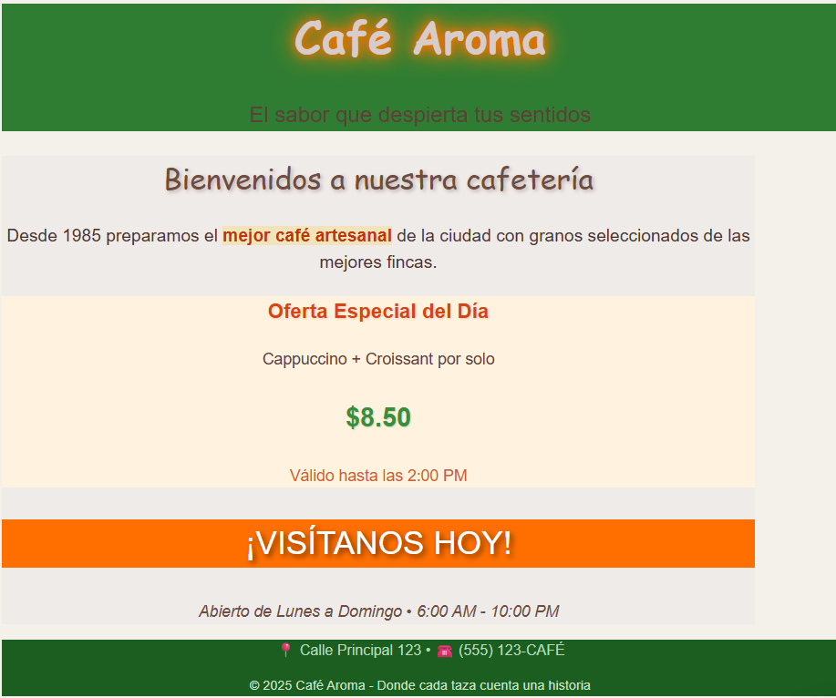

# Clase 5: Propiedades Avanzadas de Texto y Color

## 📌 Objetivos de la Clase

- Aprender propiedades avanzadas para el manejo de texto en CSS
- Entender los diferentes modelos de color y cuándo usar cada uno
- Aprender a trabajar con diferentes fuentes tipográficas
- Dominar el uso de sombras de texto para efectos visuales
- Crear un banner atractivo aplicando todos los conocimientos

## 🖌️ Propiedades avanzadas de texto

### font-size

Controla el tamaño de la fuente. Puede usarse con diferentes unidades:

- **px (píxeles)**: Tamaño fijo
- **em**: Relativo al tamaño de fuente del elemento padre
- **rem**: Relativo al tamaño de fuente del elemento raíz
- **%**: Porcentaje del tamaño de fuente del elemento padre
- **vw/vh**: Relativo al ancho/alto de la ventana

```css
.titulo {
    font-size: 24px; /* Tamaño fijo en píxeles */
}

.subtitulo {
    font-size: 1.5em; /* Relativo al tamaño del elemento padre */
}

.parrafo {
    font-size: 1rem; /* Relativo al tamaño del elemento raíz */
}
```

### font-weight

Controla el grosor de la fuente:

- **Valores numéricos**: 100, 200, 300, 400 (normal), 500, 600, 700 (negrita), 800, 900
- **Palabras clave**: normal, bold, bolder, lighter

```css
.texto-normal {
    font-weight: 400; /* Normal */
}

.texto-negrita {
    font-weight: 700; /* Negrita */
}

.texto-extra-negrita {
    font-weight: 900; /* Extra negrita */
}
```

### text-align

Controla la alineación del texto:

- **left**: Izquierda
- **right**: Derecha
- **center**: Centro
- **justify**: Justificado

```css
.texto-izquierda {
    text-align: left;
}

.texto-derecha {
    text-align: right;
}

.texto-centrado {
    text-align: center;
}

.texto-justificado {
    text-align: justify;
}
```

## 🎨 Modelos de color

### Colores por nombre

CSS tiene 140 colores con nombre predefinidos:

```css
.color-rojo {
    color: red;
}

.color-azul {
    color: blue;
}

.color-verde-claro {
    color: lightgreen;
}
```

### Colores hexadecimales

Formato: `#RRGGBB` (donde RR, GG, BB son valores hexadecimales de 00-FF)

```css
.color-rojo-hex {
    color: #FF0000;
}

.color-azul-hex {
    color: #0000FF;
}

.color-verde-hex {
    color: #00FF00;
}

/* Formato abreviado (3 dígitos) */
.color-rojo-abrev {
    color: #F00; /* Equivalente a #FF0000 */
}
```

### Colores RGB

Formato: `rgb(R, G, B)` donde R, G, B son valores de 0-255

```css
.color-rojo-rgb {
    color: rgb(255, 0, 0);
}

.color-azul-rgb {
    color: rgb(0, 0, 255);
}

.color-verde-rgb {
    color: rgb(0, 255, 0);
}
```

### Colores RGBA (con transparencia)

Formato: `rgba(R, G, B, A)` donde A es el valor alfa (transparencia) de 0-1

```css
.color-rojo-transparente {
    color: rgba(255, 0, 0, 0.5);
}

.color-azul-transparente {
    color: rgba(0, 0, 255, 0.8);
}
```

## ✍️ Trabajar con fuentes

### font-family

Especifica la familia de fuentes de un texto:

```css
.parrafo {
    font-family: "Arial", sans-serif;
}

.titulo {
    font-family: "Georgia", serif;
}

.cita {
    font-family: "Courier New", monospace;
}
```

### @font-face

Permite usar fuentes personalizadas que no están instaladas en el sistema del usuario:

```css
@font-face {
    font-family: 'MiFuentePersonalizada';
    src: url('mifuente.woff2') format('woff2'),
         url('mifuente.woff') format('woff');
    font-weight: normal;
    font-style: normal;
}

.titulo-especial {
    font-family: 'MiFuentePersonalizada', sans-serif;
}
```

### Usando Google Fonts

1. Ve a https://fonts.google.com
2. Selecciona las fuentes que deseas usar
3. Incluye el enlace en tu HTML
4. Usa la fuente en tu CSS

```html
<!-- En el <head> de tu HTML -->
<link href="https://fonts.googleapis.com/css2?family=Roboto:wght@400;700&display=swap" rel="stylesheet">
```

```css
/* En tu CSS */
body {
    font-family: 'Roboto', sans-serif;
}
```

## 🌥️ Sombra de texto (text-shadow)

Formato: `text-shadow: h-shadow v-shadow blur-radius color;`

```css
.sombra-simple {
    text-shadow: 2px 2px 4px rgba(0, 0, 0, 0.5);
}

.sombra-doble {
    text-shadow: 1px 1px 0 #fff, 
                 2px 2px 0 #333;
}

.sombra-neon {
    text-shadow: 0 0 5px #fff, 
                 0 0 10px #fff, 
                 0 0 20px #00f, 
                 0 0 40px #00f;
}
```

## 🏆 Ejercicio práctico: Mi Estudio de Diseño Explorando Texto y Color

```html
<!DOCTYPE html>
<html lang="es">
<head>
    <meta charset="UTF-8">
    <title>Mi Estudio de Diseño - Propiedades Avanzadas</title>
    
    <!-- Google Fonts -->
    <link href="https://fonts.googleapis.com/css2?family=Roboto:wght@300;400;700&family=Georgia:wght@400;700&display=swap" rel="stylesheet">
    
    <!-- CSS Interno -->
    <style>
        /* Selectores de elemento */
        body {
            background-color: #f4f4f4;
            font-family: 'Roboto', sans-serif;
            color: #333;
            line-height: 1.6;
        }
        
        h1 {
            font-size: 2.5em;
            font-weight: 700;
            text-align: center;
            color: #2c3e50;
            text-shadow: 2px 2px 4px rgba(0, 0, 0, 0.3);
            text-transform: uppercase;
        }
        
        h2 {
            font-size: 1.8em;
            font-weight: 400;
            color: #e74c3c;
            text-align: center;
        }
        
        h3 {
            font-size: 1.3em;
            font-weight: 600;
            color: #34495e;
        }
        
        p {
            font-size: 1rem;
            text-align: justify;
        }
        
        /* Selectores de clase */
        .banner-principal {
            background-color: #3498db;
            color: white;
            text-align: center;
        }
        
        .contenedor-principal {
            background-color: white;
            width: 80%;
        }
        
        .titulo-con-sombra {
            font-size: 2em;
            color: #fff;
            text-shadow: 0 0 10px #ff6b6b, 
                         0 0 20px #ff6b6b, 
                         0 0 30px #ff6b6b;
            text-align: center;
        }
        
        .texto-hexadecimal {
            color: #FF6B35;
            font-weight: 700;
            font-size: 1.2em;
        }
        
        .texto-rgb {
            color: rgb(46, 204, 113);
            font-weight: 500;
            font-size: 18px;
        }
        
        .texto-rgba {
            color: rgba(155, 89, 182, 0.8);
            font-weight: bold;
            background-color: rgba(241, 196, 15, 0.2);
        }
        
        .fuente-georgia {
            font-family: 'Georgia', serif;
            font-size: 1.1em;
            font-style: italic;
        }
        
        .texto-centrado {
            text-align: center;
            font-size: 1.5em;
            color: #2980b9;
        }
        
        .texto-derecha {
            text-align: right;
            color: #8e44ad;
            font-weight: 300;
        }
        
        .sombra-doble {
            text-shadow: 1px 1px 0 #fff, 
                         3px 3px 0 #333;
            font-size: 1.4em;
            color: #e67e22;
            font-weight: 700;
        }
        
        /* Selectores de ID */
        #encabezado {
            background-color: #34495e;
            color: white;
        }
        
        #seccion-colores {
            background-color: #ecf0f1;
        }
        
        #pie-pagina {
            background-color: #2c3e50;
            color: white;
            text-align: center;
        }
    </style>
</head>
<body>
    
    <!-- Encabezado con efectos -->
    <div id="encabezado" class="banner-principal">
        <h1>Mi Estudio de Diseño</h1>
        <div class="titulo-con-sombra">
            <h2>Explorando Texto y Color</h2>
        </div>
    </div>
    
    <!-- Contenido principal -->
    <div class="contenedor-principal">
        
        <h2>Bienvenidos a mi portfolio</h2>
        <p>Esta página demuestra el uso de propiedades avanzadas de texto y diferentes modelos de color en CSS.</p>
        
        <!-- Sección de colores -->
        <div id="seccion-colores">
            <h3 class="sombra-doble">Explorando Colores</h3>
            
            <p class="texto-hexadecimal">Este texto usa color hexadecimal #FF6B35</p>
            <p class="texto-rgb">Este texto usa RGB: rgb(46, 204, 113)</p>
            <p class="texto-rgba">Este texto usa RGBA con transparencia</p>
            
            <!-- CSS en línea con diferentes modelos -->
            <p style="color: #9b59b6; font-size: 20px; font-weight: 800; text-align: center;">Texto con CSS en línea usando hexadecimal</p>
        </div>
        
        <!-- Sección de tipografías -->
        <h3>Diferentes Tipografías</h3>
        
        <p>Este párrafo usa la fuente Roboto (Google Fonts) con peso normal.</p>
        <p class="fuente-georgia">Este párrafo usa Georgia, una fuente serif elegante y cursiva.</p>
        
        <!-- Sección de alineaciones -->
        <h3>Alineaciones de Texto</h3>
        
        <p class="texto-centrado">Texto centrado con color azul</p>
        <p class="texto-derecha">Texto alineado a la derecha</p>
        <p>Texto justificado que se extiende de manera uniforme a lo largo de toda la línea, creando márgenes parejos en ambos lados del párrafo para una apariencia más formal y organizada.</p>
        
        <!-- Sección de efectos -->
        <h3>Efectos de Texto</h3>
        <p class="sombra-doble">Texto con sombra doble</p>
        
        <div style="background-color: #2c3e50;">
            <p style="color: #fff; text-shadow: 0 0 8px #3498db, 0 0 16px #3498db; font-size: 1.3em; text-align: center; font-weight: 600;">Efecto de resplandor azul</p>
        </div>
        
    </div>
    
    <!-- Pie de página -->
    <div id="pie-pagina">
        <h3 style="font-size: 1.2em; font-weight: 400;">¡Gracias por explorar mis diseños!</h3>
        <p style="font-size: 0.9em; color: rgba(255, 255, 255, 0.8);">Creado con propiedades avanzadas de CSS - 2025</p>
    </div>
    
</body>
</html>
```

## 📎 Paletas de colores recomendadas

### 1. Paleta Minimalista
- **Primario**: #3498db (Azul brillante)
- **Secundario**: #2c3e50 (Azul oscuro)
- **Acento**: #e74c3c (Rojo)
- **Fondo**: #ecf0f1 (Gris claro)
- **Texto**: #2c3e50 (Azul oscuro)

### 2. Paleta Profesional
- **Primario**: #2980b9 (Azul)
- **Secundario**: #1abc9c (Turquesa)
- **Acento**: #f39c12 (Naranja)
- **Fondo**: #ffffff (Blanco)
- **Texto**: #34495e (Gris azulado)

### 3. Paleta Energética
- **Primario**: #9b59b6 (Morado)
- **Secundario**: #3498db (Azul)
- **Acento**: #2ecc71 (Verde)
- **Fondo**: #f8f9fa (Gris muy claro)
- **Texto**: #212529 (Negro suave)

## 🛠️ Herramientas para crear paletas de colores

- **Adobe Color**: https://color.adobe.com/es/create/color-wheel
- **Coolors**: https://coolors.co
- **Paletton**: https://paletton.com
- **Material Design Colors**: https://material.io/resources/color

## 💡 Consejos para elegir paletas

- Limita tu paleta a 3-5 colores principales
- Usa un color dominante (60%), un secundario (30%) y un acento (10%)
- Considera el contraste para accesibilidad
- Prueba cómo se ven los colores en diferentes dispositivos
- Usa herramientas de simulación de daltonismo para verificar accesibilidad

## 🏆 Reto Adicional: Banner de Bienvenida Avanzado

Crea un banner de bienvenida para un sitio web específico con:

- Al menos dos fuentes diferentes
- Paleta de colores coherente
- Efectos de sombra de texto
- Llamado a la acción destacado




## 📚 Pasos para completar el ejercicio

1. Crea un nuevo archivo en tu editor de código y guárdalo como `banner-tipografico.html`
2. Copia la estructura básica de HTML
3. Agrega la sección de estilos en el `<head>`
4. Personaliza los colores, tipografía y contenido según tus preferencias
5. Experimenta con diferentes sombras de texto
6. Guarda el archivo y ábrelo en tu navegador

¡Experimenta con diferentes combinaciones y crea tu propio estilo único!
