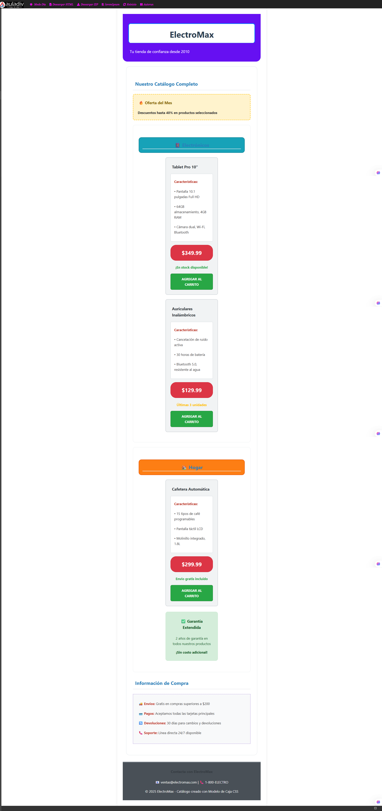

# Clase 6: Entendiendo el Modelo de Caja en CSS

## 📌 Objetivos de la Clase
- Comprender el modelo de caja (box model) y sus componentes
- Dominar el uso de márgenes (margin) y relleno (padding)
- Aprender a trabajar con bordes (border) y sus propiedades
- Entender la diferencia entre box-sizing: border-box y content-box
- Crear tarjetas de producto con espaciado adecuado

## 📦 Modelo de Caja - Conceptos Básicos

### Cálculo del tamaño total de un elemento
```
Ancho total = margin-left + border-left + padding-left + width + padding-right + border-right + margin-right
Alto total = margin-top + border-top + padding-top + height + padding-bottom + border-bottom + margin-bottom
```

## 📏 Márgenes (margin) y Relleno (padding)

### Márgenes
```css
/* Propiedades individuales */
.elemento {
    margin-top: 10px;
    margin-right: 20px;
    margin-bottom: 10px;
    margin-left: 20px;
}

/* Forma abreviada */
.elemento {
    /* top right bottom left */
    margin: 10px 20px 10px 20px;
    
    /* También se puede usar con 2 valores: */
    /* vertical horizontal */
    /* margin: 10px 20px; */
    
    /* O con 3 valores: */
    /* top horizontal bottom */
    /* margin: 10px 20px 15px; */
}
```

### Relleno (padding)
```css
/* Propiedades individuales */
.elemento {
    padding-top: 10px;
    padding-right: 20px;
    padding-bottom: 10px;
    padding-left: 20px;
}

/* Forma abreviada */
.elemento {
    /* top right bottom left */
    padding: 10px 20px 10px 20px;
}
```

## 🔲 Bordes (border) y sus propiedades

### Estilos de borde
```css
/* Forma detallada */
.elemento {
    border-width: 2px;
    border-style: solid;
    border-color: #333;
}

/* Forma abreviada */
.elemento {
    border: 2px solid #333;
}

/* Bordes individuales */
.elemento {
    border-top: 1px solid #000;
    border-right: 2px dashed #f00;
    border-bottom: 3px double #0f0;
    border-left: 4px dotted #00f;
}

/* Bordes redondeados */
.elemento {
    border-radius: 15px;
    /* También se puede especificar cada esquina */
    /* border-radius: 10px 20px 30px 40px; */
}
```

## 📐 Box-sizing: border-box vs content-box

### content-box (valor por defecto)
```css
.contenido-box {
    box-sizing: content-box;
    width: 300px;
    padding: 20px;
    border: 10px solid #333;
    /* Ancho total = 300px + 20px + 20px + 10px + 10px = 360px */
}
```

### border-box (recomendado)
```css
.border-box {
    box-sizing: border-box;
    width: 300px;
    padding: 20px;
    border: 10px solid #333;
    /* Ancho total = 300px (incluye padding y borde) */
}
```

### Configuración recomendada
```css
* {
    box-sizing: border-box;
}
```

## 🏆 Ejercicio Práctico: Tarjetas de Productos

### HTML Completo
```html
<!DOCTYPE html>
<html lang="es">
<head>
    <meta charset="UTF-8">
    <title>Tienda de Productos - Modelo de Caja</title>
    
    <!-- CSS Interno -->
    <style>
        /* Configuración recomendada para box-sizing */
        * {
            box-sizing: border-box;
        }
        
        /* Selectores de elemento */
        body {
            background-color: #f5f5f5;
            font-family: Arial, sans-serif;
            color: #333;
            line-height: 1.6;
            margin: 0;
            padding: 20px;
        }
        
        h1 {
            text-align: center;
            color: #2c3e50;
            font-size: 2.5em;
            margin: 20px 0;
            padding: 15px;
            border: 3px solid #3498db;
            border-radius: 10px;
        }
        
        h2 {
            color: #34495e;
            font-size: 1.8em;
            margin: 25px 0 15px 0;
            padding: 10px;
            border-left: 5px solid #e74c3c;
        }
        
        h3 {
            color: #2980b9;
            margin: 15px 0 10px 0;
            padding: 8px;
        }
        
        p {
            margin: 10px 0;
            padding: 5px;
        }
        
        /* Selectores de clase */
        .contenedor-principal {
            background-color: white;
            width: 90%;
            margin: 20px auto;
            padding: 30px;
            border: 2px solid #bdc3c7;
            border-radius: 15px;
        }
        
        .tarjeta-producto {
            background-color: #ecf0f1;
            width: 300px;
            margin: 20px auto;
            padding: 20px;
            border: 2px solid #95a5a6;
            border-radius: 8px;
        }
        
        .precio-producto {
            background-color: #27ae60;
            color: white;
            font-size: 1.5em;
            font-weight: bold;
            text-align: center;
            margin: 15px 0;
            padding: 15px;
            border: 3px solid #229954;
            border-radius: 25px;
        }
        
        .boton-comprar {
            background-color: #e67e22;
            color: white;
            font-size: 1.2em;
            font-weight: bold;
            text-align: center;
            margin: 20px 0;
            padding: 12px 25px;
            border: 2px solid #d35400;
            border-radius: 5px;
            width: 100%;
        }
        
        .caja-destacada {
            background-color: #fff3cd;
            border: 3px dashed #ffc107;
            margin: 25px 0;
            padding: 20px;
            border-radius: 12px;
        }
        
        .texto-con-borde {
            border: 1px solid #6c757d;
            padding: 15px;
            margin: 10px 0;
            border-radius: 6px;
        }
        
        /* Selectores de ID */
        #encabezado-tienda {
            background-color: #3498db;
            color: white;
            margin: 0 0 30px 0;
            padding: 25px;
            border-radius: 0 0 20px 20px;
        }
        
        #seccion-productos {
            margin: 30px 0;
            padding: 25px;
            border: 2px solid #d5dbdb;
        }
        
        #pie-tienda {
            background-color: #2c3e50;
            color: white;
            text-align: center;
            margin: 30px 0 0 0;
            padding: 20px;
            border-top: 4px solid #34495e;
        }
    </style>
</head>
<body>
    
    <!-- Encabezado de la tienda -->
    <div id="encabezado-tienda">
        <h1>TechStore</h1>
        <p style="font-size: 1.2em; margin: 0; padding: 5px;">Los mejores productos tecnológicos</p>
    </div>
    
    <!-- Contenedor principal -->
    <div class="contenedor-principal">
        
        <h2>Productos Destacados</h2>
        
        <div class="caja-destacada">
            <h3>¡Ofertas Especiales!</h3>
            <p>Todos nuestros productos tienen <strong>descuentos</strong> especiales esta semana.</p>
        </div>
        
        <!-- Sección de productos -->
        <div id="seccion-productos">
            
            <!-- Primera tarjeta de producto -->
            <div class="tarjeta-producto">
                <h3>Laptop Gaming Pro</h3>
                <p class="texto-con-borde">Procesador Intel i7, 16GB RAM, RTX 3060, SSD 512GB</p>
                
                <div class="precio-producto">$1,299.99</div>
                
                <p>Perfecta para gaming y trabajo profesional. Incluye garantía de 2 años.</p>
                
                <div class="boton-comprar">COMPRAR AHORA</div>
            </div>
            
            <!-- Segunda tarjeta de producto -->
            <div class="tarjeta-producto">
                <h3>Smartphone Ultra</h3>
                <p class="texto-con-borde">128GB almacenamiento, cámara triple, pantalla AMOLED 6.5"</p>
                
                <div class="precio-producto">$699.99</div>
                
                <p>El teléfono más avanzado del mercado con tecnología 5G incluida.</p>
                
                <div class="boton-comprar">COMPRAR AHORA</div>
            </div>
            
            <!-- CSS en línea para demostrar variedad -->
            <div style="background-color: #e8f5e8; border: 2px solid #4caf50; margin: 25px auto; padding: 20px; width: 300px; border-radius: 10px;">
                <h3 style="color: #2e7d32; margin: 0 0 15px 0;">Envío Gratis</h3>
                <p style="margin: 0; padding: 5px;">En compras mayores a $500. Entrega en 24-48 horas.</p>
            </div>
            
        </div>
        
        <h2>¿Por qué elegirnos?</h2>
        
        <div style="border: 2px dotted #9b59b6; padding: 20px; margin: 20px 0; background-color: #f8f9fa;">
            <p><strong>✓ Garantía extendida:</strong> Todos nuestros productos incluyen garantía</p>
            <p><strong>✓ Soporte técnico:</strong> Atención 24/7 para resolver tus dudas</p>
            <p><strong>✓ Mejores precios:</strong> Precios competitivos en el mercado</p>
        </div>
        
    </div>
    
    <!-- Pie de página -->
    <div id="pie-tienda">
        <p style="margin: 0 0 10px 0; font-size: 1.1em;">📧 contacto@techstore.com | 📞 (555) 123-4567</p>
        <p style="margin: 0; padding: 5px;">© 2025 TechStore - Modelo de Caja CSS</p>
    </div>
    
</body>
```

## 🏆 Reto Adicional: Catálogo de Productos Responsivo

### HTML del Catálogo Avanzado


## 📎 Cheat Sheet del Modelo de Caja

### Componentes del modelo de caja:
- **Contenido**: Área donde se muestra el texto o imagen
- **Relleno (padding)**: Espacio entre contenido y borde
- **Borde (border)**: Línea que rodea el contenido y relleno
- **Márgenes (margin)**: Espacio exterior entre bordes

### Propiedades de márgenes:
```css
margin-top, margin-right, margin-bottom, margin-left
margin: top right bottom left /* forma abreviada */
margin: vertical horizontal
margin: top horizontal bottom
```

### Propiedades de relleno:
```css
padding-top, padding-right, padding-bottom, padding-left
padding: top right bottom left /* forma abreviada */
padding: vertical horizontal
```

### Propiedades de bordes:
```css
border-width: /* Ancho del borde */
border-style: /* solid, dotted, dashed, double */
border-color: /* Color del borde */
border-radius: /* Radio de las esquinas */
border: width style color /* forma abreviada */
```

### Box-sizing:
```css
box-sizing: content-box; /* por defecto */
box-sizing: border-box; /* recomendado */

/* Aplicar a todos los elementos */
* { box-sizing: border-box; }
```

## 🛠️ Herramientas del Navegador

### Acceso:
- **Chrome/Firefox/Edge**: F12 o Ctrl+Shift+I (Windows) / Cmd+Opt+I (Mac)
- **Safari**: Habilitar herramientas de desarrollador en Preferencias > Avanzado

### Inspección del modelo de caja:
1. Abrir herramientas de desarrollo
2. Clic en "Inspeccionar elemento" o Ctrl+Shift+C / Cmd+Shift+C
3. Seleccionar elemento en la página
4. Ver sección del modelo de caja en panel "Elements"/"Inspector"

### Consejos profesionales:
- Usar modo "Layout" en Chrome para overlays de grid/flexbox
- Activar "Box Model" en Firefox para más detalles
- Modificar valores en tiempo real para experimentar
- Usar selector de color integrado

## 💡 Consejos para el Reto

1. **Estructura HTML**: Empieza con la estructura antes de añadir estilos
2. **Box-sizing**: Usa `box-sizing: border-box` en todos los elementos
3. **Consistencia**: Aplica márgenes y rellenos de manera consistente
4. **Responsivo**: Usa grid o flexbox para diseño adaptable
5. **Experimentación**: Prueba diferentes valores para bordes y radios
6. **Compatibilidad**: Asegúrate de que funcione en móviles y escritorio
7. **Animaciones**: Añade efectos sutiles con `:hover` si te sientes cómodo
