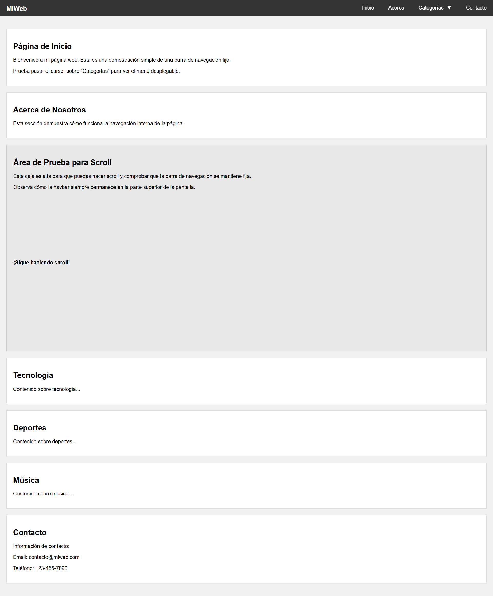

# Clase 7: Posicionamiento y Visualización de Elementos

## 📌 Objetivos de la Clase

- Aprender a controlar la posición de los elementos en una página web
- Entender el uso de la propiedad position con sus diferentes valores
- Dominar el uso de z-index para controlar la superposición de elementos
- Conocer la propiedad display y cómo afecta al flujo del documento
- Aprender a manejar el overflow y contenido que excede sus contenedores
- Crear una barra de navegación fija con menú desplegable funcional
- Entender la diferencia entre flujo normal y posicionamiento en CSS

## 📐 Propiedad position

La propiedad position en CSS controla cómo se posiciona un elemento en relación con su contenedor o la ventana del navegador.

### position: static (por defecto)

Los elementos se posicionan de acuerdo con el flujo normal del documento. Los valores top, right, bottom, y left no tienen efecto en elementos con posición estática.

```css
.elemento-static {
    position: static;
    /* top, right, bottom, left no tendrán efecto */
}
```

### position: relative

Permite desplazar un elemento respecto a su posición normal utilizando las propiedades top, right, bottom, y left.

```css
.elemento-relative {
    position: relative;
    top: 20px;    /* Se desplaza 20px hacia abajo */
    left: 30px;   /* Se desplaza 30px hacia la derecha */
}
```

**Características:**
- El elemento mantiene su espacio en el flujo normal del documento
- El desplazamiento es relativo a la posición original del elemento
- Sirve como punto de referencia para elementos posicionados absolutamente

### position: absolute

Posiciona el elemento en relación con su primer contenedor posicionado (que no sea static), utilizando las propiedades top, right, bottom, y left.

```css
.contenedor {
    position: relative; /* Necesario para que el elemento absoluto se posicione respecto a este */
}

.elemento-absolute {
    position: absolute;
    top: 10px;   /* 10px desde el borde superior del contenedor posicionado */
    left: 10px;  /* 10px desde el borde izquierdo del contenedor posicionado */
}
```

**Características:**
- El elemento es sacado del flujo normal del documento
- No ocupa espacio en el flujo normal
- Se posiciona respecto al contenedor posicionado más cercano (o al body si no hay ninguno)

### position: fixed

Fija el elemento en relación con la ventana del navegador, permaneciendo en su posición incluso al hacer scroll.

```css
.elemento-fixed {
    position: fixed;
    top: 0;
    right: 0;
    width: 200px;
    height: 100px;
}
```

**Características:**
- El elemento es sacado del flujo normal del documento
- No ocupa espacio en el flujo normal
- Se posiciona respecto a la ventana del navegador
- Permanece fijo al hacer scroll

### position: sticky

Combina aspectos de relative y fixed. El elemento se comporta como relative hasta que alcanza un punto de desplazamiento definido, donde se convierte en fixed.

```css
.elemento-sticky {
    position: -webkit-sticky; /* Para compatibilidad con Safari */
    position: sticky;
    top: 0; /* Se fija cuando el borde superior alcanza los 0px de la ventana */
}
```

**Características:**
- Requiere un umbral de desplazamiento (como top, bottom, etc.)
- Se comporta como relative hasta que se alcanza el umbral
- Luego se comporta como fixed hasta que el contenedor padre sale de la vista
- Muy útil para encabezados y barras de navegación

## 🌐 Z-index y superposición de elementos

El z-index en CSS controla la superposición de elementos posicionados (con position diferente a static). Funciona en conjunto con las propiedades position: relative, absolute, fixed, o sticky.

```css
.elemento1 {
    position: absolute;
    z-index: 1;
}

.elemento2 {
    position: absolute;
    z-index: 2; /* Se superpondrá sobre elemento1 */
}
```

### Reglas importantes:

- Los valores pueden ser números positivos, negativos o auto
- Un valor más alto significa que el elemento se dibujará sobre otros elementos con un valor menor
- Los elementos con el mismo z-index se superponen según su orden en el HTML (los últimos en el código aparecen encima)
- Solo funciona en elementos posicionados (con position diferente a static)
- Los elementos con z-index crean un nuevo contexto de apilamiento

### Contextos de apilamiento

Un contexto de apilamiento es un grupo de elementos que se superponen entre sí, independientemente de otros contextos. Cada elemento posicionado con un z-index explícito crea un nuevo contexto de apilamiento.

## 🧩 Propiedad display

La propiedad display define cómo un elemento se debe mostrar en la página.

### display: block

- El elemento se comporta como un bloque, ocupando todo el ancho disponible
- Los elementos en bloque comienzan en una nueva línea
- Pueden tener ancho, alto, márgenes y relleno definidos

```css
.block-element {
    display: block;
    width: 200px;
    height: 100px;
}
```

**Ejemplos de elementos en bloque por defecto:** `<div>`, `<p>`, `<h1>`-`<h6>`, `<ul>`, `<li>`

### display: inline

- El elemento se comporta como un elemento en línea, ocupando solo el ancho que necesite
- Los elementos en línea no comienzan en una nueva línea
- No pueden tener ancho ni alto definidos (aunque sí márgenes y relleno horizontales)

```css
.inline-element {
    display: inline;
    /* width y height no tendrán efecto */
    margin: 10px; /* Solo margen horizontal tendrá efecto visual */
}
```

**Ejemplos de elementos en línea por defecto:** `<span>`, `<a>`, `<strong>`, `<em>`

### display: inline-block

- Combina características de block e inline
- Se comporta como un elemento en línea, pero permite definir ancho, alto, márgenes y relleno
- Útil para crear elementos que fluyen en línea pero tienen dimensiones específicas

```css
.inline-block-element {
    display: inline-block;
    width: 150px;
    height: 50px;
    margin: 10px;
}
```

### display: none

- Oculta completamente el elemento
- El elemento no ocupa espacio en el documento
- Diferente de `visibility: hidden` (que oculta el elemento pero mantiene su espacio)

```css
.hidden-element {
    display: none; /* El elemento desaparece y no ocupa espacio */
}
```

## 📦 Overflow y manejo de contenido que excede

La propiedad overflow controla qué sucede si el contenido de un elemento se desborda del área asignada.

### overflow: visible (por defecto)

- El contenido desbordado es visible
- El contenido que excede aparece fuera del contenedor

```css
.visible-overflow {
    overflow: visible;
}
```

### overflow: hidden

- El contenido desbordado se corta y no es visible
- No se añaden barras de desplazamiento

```css
.hidden-overflow {
    overflow: hidden;
}
```

### overflow: scroll

- Se añaden barras de desplazamiento para acceder al contenido desbordado
- Las barras de desplazamiento siempre están presentes, incluso si no hay desbordamiento

```css
.scroll-overflow {
    overflow: scroll;
}
```

### overflow: auto

- Se añaden barras de desplazamiento solo si es necesario
- Muy útil para contenedores con contenido dinámico

```css
.auto-overflow {
    overflow: auto;
}
```

### overflow-x y overflow-y

Permiten controlar el desbordamiento horizontal y vertical por separado:

```css
.x-overflow {
    overflow-x: auto; /* Desplazamiento horizontal */
    overflow-y: hidden; /* Sin desplazamiento vertical */
}
```

## 🏆 Ejercicio práctico: Crear una barra de navegación fija con menú desplegable

```html
<!DOCTYPE html>
<html lang="es">
<head>
    <meta charset="UTF-8">
    <meta name="viewport" content="width=device-width, initial-scale=1.0">
    <title>Barra de Navegación Fija</title>
    <style>
        * {
            box-sizing: border-box;
            margin: 0;
            padding: 0;
        }
        
        body {
            font-family: 'Segoe UI', Tahoma, Geneva, Verdana, sans-serif;
            line-height: 1.6;
            color: #333;
            padding-top: 70px; /* Espacio para la barra fija */
        }
        
        /* Contenido principal */
        .content {
            max-width: 1200px;
            margin: 0 auto;
            padding: 20px;
        }
        
        header {
            text-align: center;
            margin-bottom: 30px;
        }
        
        h1 {
            color: #2c3e50;
            margin-bottom: 10px;
        }
        
        .subtitle {
            color: #7f8c8d;
            max-width: 600px;
            margin: 0 auto 20px;
        }
        
        /* Barra de navegación fija */
        .navbar {
            position: fixed;
            top: 0;
            width: 100%;
            background-color: #2c3e50;
            box-shadow: 0 2px 10px rgba(0, 0, 0, 0.1);
            z-index: 1000;
        }
        
        .navbar-container {
            max-width: 1200px;
            margin: 0 auto;
            display: flex;
            justify-content: space-between;
            align-items: center;
            padding: 0 20px;
        }
        
        .logo {
            color: white;
            font-size: 1.5rem;
            font-weight: bold;
            padding: 15px 0;
            text-decoration: none;
        }
        
        .nav-menu {
            display: flex;
            list-style: none;
        }
        
        .nav-item {
            position: relative;
        }
        
        .nav-link {
            color: white;
            display: block;
            padding: 18px 20px;
            text-decoration: none;
            transition: background-color 0.3s;
        }
        
        .nav-link:hover {
            background-color: #3498db;
        }
        
        /* Menú desplegable */
        .dropdown {
            position: absolute;
            top: 100%;
            left: 0;
            background-color: #34495e;
            min-width: 200px;
            box-shadow: 0 8px 16px rgba(0, 0, 0, 0.2);
            opacity: 0;
            visibility: hidden;
            transform: translateY(-10px);
            transition: all 0.3s ease;
        }
        
        .nav-item:hover .dropdown {
            opacity: 1;
            visibility: visible;
            transform: translateY(0);
        }
        
        .dropdown-item {
            color: white;
            padding: 12px 20px;
            text-decoration: none;
            display: block;
            transition: background-color 0.3s;
        }
        
        .dropdown-item:hover {
            background-color: #2c3e50;
        }
        
        /* Contenido de demostración */
        .section {
            margin-bottom: 40px;
            padding: 40px;
            background-color: #ecf0f1;
            border-radius: 8px;
        }
        
        .section h2 {
            color: #2c3e50;
            margin-bottom: 20px;
        }
        
        .section p {
            margin-bottom: 15px;
            text-align: justify;
        }
        
        /* Responsivo */
        @media (max-width: 768px) {
            .navbar-container {
                flex-direction: column;
                padding: 10px;
            }
            
            .nav-menu {
                margin-top: 10px;
            }
            
            .nav-link {
                padding: 10px 15px;
            }
            
            body {
                padding-top: 120px;
            }
        }
    </style>
</head>
<body>
    <!-- Barra de navegación fija -->
    <nav class="navbar">
        <div class="navbar-container">
            <a href="#" class="logo">MiSitio</a>
            <ul class="nav-menu">
                <li class="nav-item">
                    <a href="#" class="nav-link">Inicio</a>
                </li>
                <li class="nav-item">
                    <a href="#" class="nav-link">Servicios</a>
                    <div class="dropdown">
                        <a href="#" class="dropdown-item">Desarrollo Web</a>
                        <a href="#" class="dropdown-item">Diseño Gráfico</a>
                        <a href="#" class="dropdown-item">Marketing Digital</a>
                        <a href="#" class="dropdown-item">Consultoría</a>
                    </div>
                </li>
                <li class="nav-item">
                    <a href="#" class="nav-link">Portafolio</a>
                </li>
                <li class="nav-item">
                    <a href="#" class="nav-link">Sobre Nosotros</a>
                </li>
                <li class="nav-item">
                    <a href="#" class="nav-link">Contacto</a>
                </li>
            </ul>
        </div>
    </nav>

    <!-- Contenido principal -->
    <div class="content">
        <header>
            <h1>Bienvenido a Nuestro Sitio Web</h1>
            <p class="subtitle">
                Esta es una demostración de una barra de navegación fija con menú desplegable.
                Haz scroll para ver cómo la barra permanece en la parte superior de la pantalla.
            </p>
        </header>

        <div class="section">
            <h2>Sección 1: Posicionamiento Fixed</h2>
            <p>
                La barra de navegación utiliza <code>position: fixed</code> para mantenerse
                siempre visible en la parte superior de la pantalla, incluso cuando haces scroll.
                Esto mejora la experiencia del usuario al permitir navegación constante.
            </p>
            <p>
                El elemento fijo se posiciona respecto a la ventana del navegador y no ocupa
                espacio en el flujo normal del documento. Por eso añadimos padding-top al body
                para evitar que el contenido quede oculto detrás de la barra.
            </p>
        </div>

        <div class="section">
            <h2>Sección 2: Z-index y Superposición</h2>
            <p>
                La barra de navegación tiene un <code>z-index: 1000</code> para asegurar que
                aparezca por encima de otros elementos de la página. El menú desplegable
                también utiliza z-index para superponerse correctamente.
            </p>
            <p>
                Los valores altos de z-index garantizan que los elementos de navegación
                siempre estén visibles, sin importar qué otros elementos posicionados
                pueda tener la página.
            </p>
        </div>

        <div class="section">
            <h2>Sección 3: Menú Desplegable con Position Absolute</h2>
            <p>
                El menú desplegable utiliza <code>position: absolute</code> para posicionarse
                respecto a su contenedor padre (que tiene <code>position: relative</code>).
                Esto permite que el menú aparezca exactamente debajo del elemento de navegación.
            </p>
            <p>
                Las transiciones CSS crean efectos suaves de aparición y desaparición,
                mejorando la experiencia visual del usuario al interactuar con el menú.
            </p>
        </div>

        <div class="section">
            <h2>Sección 4: Contenido de Prueba</h2>
            <p>
                Esta sección existe para demostrar cómo el contenido fluye normalmente
                debajo de la barra de navegación fija. Puedes seguir haciendo scroll
                para ver más contenido y comprobar que la navegación siempre permanece accesible.
            </p>
            <p>
                El diseño es responsivo y se adapta a diferentes tamaños de pantalla,
                reorganizando los elementos de navegación en dispositivos móviles.
            </p>
        </div>

        <div class="section">
            <h2>Sección 5: Más Contenido</h2>
            <p>
                Lorem ipsum dolor sit amet, consectetur adipiscing elit. Sed do eiusmod
                tempor incididunt ut labore et dolore magna aliqua. Ut enim ad minim veniam,
                quis nostrud exercitation ullamco laboris nisi ut aliquip ex ea commodo consequat.
            </p>
            <p>
                Duis aute irure dolor in reprehenderit in voluptate velit esse cillum dolore
                eu fugiat nulla pariatur. Excepteur sint occaecat cupidatat non proident,
                sunt in culpa qui officia deserunt mollit anim id est laborum.
            </p>
        </div>
    </div>
</body>
</html>
```

### Pasos para completar el ejercicio:

1. Crea un nuevo archivo en tu editor de código y guárdalo como `navbar-fija.html`
2. Copia la estructura básica de HTML
3. Agrega las secciones de estilos en el `<head>`
4. Personaliza los colores, logo y contenido del menú según tus preferencias
5. Ajusta la altura de la barra de navegación y el padding-top del body
6. Prueba el comportamiento al hacer scroll
7. Asegúrate de que el menú desplegable funcione correctamente
8. Verifica que el diseño sea responsivo (prueba en diferentes tamaños de pantalla)
9. Guarda el archivo y ábrelo en tu navegador

## 📎 Recurso adicional: Flujo normal vs posicionamiento en CSS

### Flujo normal del documento

- Los elementos se posicionan en el orden en que aparecen en el HTML
- Los elementos en bloque (`<div>`, `<p>`, `<h1>`, etc.) ocupan todo el ancho disponible y comienzan en una nueva línea
- Los elementos en línea (`<span>`, `<a>`, `<strong>`, etc.) ocupan solo el ancho necesario y no comienzan en una nueva línea
- El posicionamiento es secuencial: un elemento aparece después del anterior

### Posicionamiento en CSS

- **static**: Posicionamiento por defecto (flujo normal)
- **relative**: Desplaza el elemento desde su posición original en el flujo normal
- **absolute**: Saca el elemento del flujo normal y lo posiciona respecto a su contenedor posicionado
- **fixed**: Saca el elemento del flujo normal y lo posiciona respecto a la ventana del navegador
- **sticky**: Comportamiento híbrido entre relative y fixed

### Tabla de Diferencias:

| Propiedad | Ocupa espacio en el flujo | Posicionamiento respecto a | Afecta a otros elementos | Usa propiedades top/right/bottom/left | Se mantiene al hacer scroll |
|-----------|--------------------------|----------------------------|-------------------------|-------------------------------------|---------------------------|
| **static** | Sí | Orden en el HTML | Sí | No | N/A |
| **relative** | Sí | Su posición original | Sí | Sí | N/A |
| **absolute** | No | Contenedor posicionado | No | Sí | N/A |
| **fixed** | No | Ventana del navegador | No | Sí | Sí |
| **sticky** | Sí/No (depende del scroll) | Contenedor + ventana | Sí/No | Sí | Depende del umbral |

### Cuándo usar cada tipo de posicionamiento:

- **Flujo normal**: Para la estructura básica de la página
- **relative**: Para pequeños ajustes de posición o como contenedor para elementos absolutos
- **absolute**: Para elementos que deben posicionarse con precisión dentro de un contenedor
- **fixed**: Para elementos que deben permanecer visibles al hacer scroll (barras de navegación)
- **sticky**: Para elementos que deben fijarse después de un punto de desplazamiento específico

## 🏆 Reto Adicional: Crear un Diseño con Superposición y Efectos Sticky

¡Felicidades por completar los ejercicios de posicionamiento y visualización de elementos! Aquí tienes un reto adicional para que practiques aún más:

### 📚 Descripción del Reto

Crea una página web con un diseño creativo que combine múltiples técnicas de posicionamiento y visualización:

- Una barra de navegación fija con menú desplegable funcional
- Un encabezado con imagen de fondo y texto superpuesto usando z-index
- Secciones con posicionamiento sticky para destacar contenido al hacer scroll
- Elementos flotantes con diferentes valores de z-index para crear efectos de superposición
- Contenedores con overflow controlado para elementos que exceden sus límites
- Uso creativo de display: inline-block para crear una galería de imágenes responsiva

### 📌 Ejemplo de Cómo Debería Verse



## 📋 Descripción del Reto
Utilizando únicamente los conceptos de **posicionamiento CSS** y **visualización de elementos** vistos en la Clase 7, deberás crear una barra de navegación fija con menú desplegable funcional.

## 🎯 Objetivos
Al completar este reto, habrás practicado:
- ✅ `position: fixed` para elementos fijos
- ✅ `position: absolute` para menús desplegables
- ✅ `position: relative` como contenedor de referencia
- ✅ `z-index` para controlar la superposición
- ✅ `display: none/block` para mostrar/ocultar elementos
- ✅ Pseudo-clase `:hover` para interactividad
- ✅ Enlaces internos con IDs

## 🛠️ Especificaciones Técnicas

### **Navbar Principal**
- Debe estar **fija** en la parte superior de la página
- Alto de **50px**
- Fondo color **#333**
- Debe permanecer visible al hacer scroll
- `z-index` apropiado para estar sobre otros elementos

### **Logo**
- Posicionado a la **izquierda**
- Color blanco
- Texto: "MiWeb" (o el que prefieras)
- Tamaño de fuente: **20px**

### **Menú de Navegación**
- Posicionado a la **derecha** de la navbar
- Debe contener al menos 4 elementos:
  1. **Inicio**
  2. **Acerca**
  3. **Categorías** (con menú desplegable)
  4. **Contacto**

### **Menú Desplegable**
- Se activa al pasar el cursor sobre "Categorías"
- Debe contener al menos 4 opciones:
  - Tecnología
  - Deportes
  - Música
  - Viajes
- Fondo más oscuro que la navbar principal
- Se oculta cuando el cursor sale del área

### **Contenido Principal**
- Debe tener margen superior para no quedar oculto bajo la navbar
- Incluir secciones con IDs que correspondan a los enlaces del menú
- Una sección alta para probar el scroll

## 📝 Estructura HTML Requerida

```html
<!DOCTYPE html>
<html lang="es">
<head>
    <meta charset="UTF-8">
    <meta name="viewport" content="width=device-width, initial-scale=1.0">
    <title>Mi Navbar - Reto</title>
    <style>
        /* Aquí va tu CSS */
    </style>
</head>
<body>
    <nav class="navbar">
        <!-- Logo aquí -->
        <!-- Menú aquí -->
    </nav>
    
    <div class="content">
        <!-- Secciones de contenido aquí -->
    </div>
</body>
</html>
```

## 🎨 Propiedades CSS que DEBES Usar

### **Para la Navbar:**
```css
position: fixed;
top: 0;
width: 100%;
z-index: [valor apropiado];
```

### **Para el Menú Desplegable:**
```css
position: absolute;
display: none; /* Inicialmente oculto */
```

### **Para Mostrar el Menú:**
```css
.elemento:hover .dropdown {
    display: block;
}
```

## 🚫 Restricciones
- **NO usar** Flexbox (`display: flex`)
- **NO usar** CSS Grid (`display: grid`)
- **NO usar** transiciones o animaciones
- **NO usar** JavaScript
- Solo usar las propiedades vistas en clase

## ✅ Criterios de Evaluación

### **Funcionalidad (40%)**
- [ ] La navbar permanece fija al hacer scroll
- [ ] El menú desplegable aparece al hacer hover
- [ ] El menú desplegable desaparece al quitar el cursor
- [ ] Los enlaces internos funcionan correctamente

### **Posicionamiento (30%)**
- [ ] Uso correcto de `position: fixed`
- [ ] Uso correcto de `position: absolute`
- [ ] Uso correcto de `position: relative`
- [ ] `z-index` aplicado correctamente

### **Visualización (20%)**
- [ ] Uso correcto de `display: inline-block`
- [ ] Uso correcto de `display: none/block`
- [ ] El contenido no queda oculto bajo la navbar

### **Código Limpio (10%)**
- [ ] CSS bien organizado con comentarios
- [ ] Nombres de clases descriptivos
- [ ] Estructura HTML semánticamente correcta

## 💡 Tips para Completar el Reto

1. **Comienza con la estructura HTML** básica
2. **Aplica primero** `position: fixed` a la navbar
3. **Posiciona el logo** a la izquierda con `display: inline-block`
4. **Posiciona el menú** a la derecha con `position: absolute`
5. **Crea el menú desplegable** con `position: absolute` y `display: none`
6. **Usa `:hover`** para mostrar/ocultar el dropdown
7. **Ajusta los z-index** si hay problemas de superposición
8. **Añade contenido** con suficiente altura para probar el scroll

## 🎯 Resultado Esperado

Al finalizar, deberías tener:
- ✅ Una navbar que permanece fija al hacer scroll
- ✅ Un menú desplegable funcional que aparece al hacer hover
- ✅ Enlaces que llevan a secciones específicas de la página
- ✅ Diseño limpio usando solo posicionamiento básico

## 🔍 Preguntas de Autoevaluación

1. ¿Por qué usas `position: fixed` en lugar de `position: absolute`?
2. ¿Qué papel juega `position: relative` en el contenedor del dropdown?
3. ¿Por qué es importante el `z-index` en este proyecto?
4. ¿Cómo funciona la pseudo-clase `:hover` con `display: none/block`?

---

**¡Buena suerte con tu reto!** 🚀

*Recuerda: El objetivo es practicar los conceptos de posicionamiento, no crear el diseño más bonito. Enfócate en que la funcionalidad sea correcta.*


