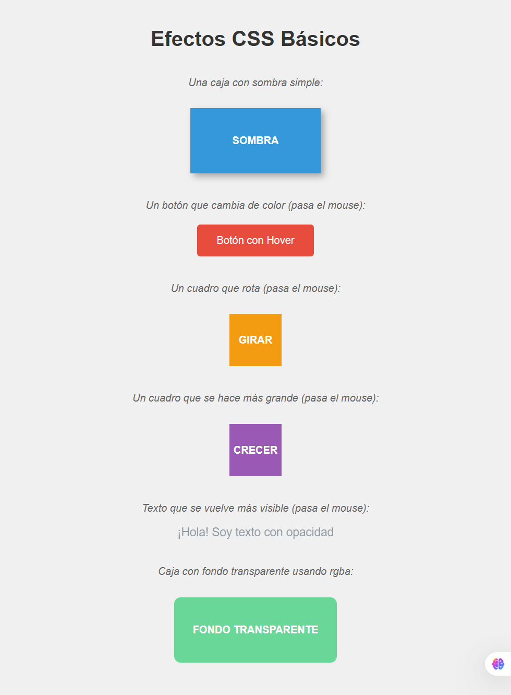

# Clase 8: Efectos Avanzados y Transiciones

## 📌 Objetivos de la Clase

- Aprender a aplicar sombras de caja (box-shadow) para dar profundidad a los elementos
- Dominar el uso de opacidad (opacity) y colores RGBA para efectos de transparencia
- Entender las transformaciones básicas (rotate, scale, translate) para animar elementos
- Implementar transiciones suaves (transition) para mejorar la experiencia de usuario
- Crear botones interactivos con efectos hover atractivos
- Conocer técnicas para usar efectos sin afectar el rendimiento del sitio

## 🌥️ Sombra de caja (box-shadow)

La propiedad `box-shadow` en CSS permite añadir sombras a los elementos, creando efectos de profundidad y dimensiones.

### Sintaxis básica

```css
.elemento {
    box-shadow: offset-x offset-y blur-radius spread-radius color;
}
```

### Parámetros

- **offset-x**: Desplazamiento horizontal de la sombra (positivo = derecha, negativo = izquierda)
- **offset-y**: Desplazamiento vertical de la sombra (positivo = abajo, negativo = arriba)
- **blur-radius**: Difuminado de la sombra (mayor valor = más difuminado)
- **spread-radius**: Tamaño de expansión de la sombra (positivo = más grande, negativo = más pequeño)
- **color**: Color de la sombra

### Ejemplos prácticos

```css
/* Sombra simple */
.sombra-simple {
    box-shadow: 5px 5px 10px rgba(0, 0, 0, 0.3);
}

/* Sombra elevada (efecto de elevación) */
.sombra-elevada {
    box-shadow: 0 4px 8px rgba(0, 0, 0, 0.2);
}

/* Sombra interna */
.sombra-interna {
    box-shadow: inset 2px 2px 5px rgba(0, 0, 0, 0.2);
}

/* Múltiples sombras */
.sombras-multiples {
    box-shadow: 5px 5px 10px rgba(0, 0, 0, 0.3),
                -5px -5px 10px rgba(255, 255, 255, 0.5);
}
```

### Consejos para sombras efectivas

- Usa valores `rgba()` para controlar la opacidad de la sombra
- Para efectos de elevación realistas, aumenta el `blur-radius` y reduce la opacidad
- Las sombras internas (`inset`) son excelentes para crear efectos de hundimiento
- Combina múltiples sombras para efectos complejos y realistas

## 🌫️ Opacidad (opacity) y rgba

### Propiedad opacity

Controla la transparencia de un elemento y todos sus hijos.

```css
.elemento {
    opacity: 0.7; /* 0 = totalmente transparente, 1 = totalmente opaco */
}
```

### Ventaja de RGBA

Mientras `opacity` afecta a todo el elemento y sus hijos, `rgba()` permite definir colores con transparencia sin afectar al contenido interno.

```css
/* Fondo transparente sin afectar al texto */
.fondo-transparente {
    background-color: rgba(0, 0, 0, 0.5); /* Negro al 50% de opacidad */
}

/* Texto con color transparente */
.texto-transparente {
    color: rgba(255, 0, 0, 0.7); /* Rojo al 70% de opacidad */
}
```

### Diferencias clave

- **opacity**: Afecta a todo el elemento y sus hijos (valores de 0 a 1)
- **rgba()**: Solo afecta al color específico (opacidad como cuarto valor)
- **hsla()**: Similar a rgba pero con sistema de color HSL

### Ejemplos prácticos

```css
/* Tarjeta con fondo semitransparente */
.tarjeta {
    background-color: rgba(255, 255, 255, 0.85);
    border: 1px solid rgba(0, 0, 0, 0.1);
}

/* Overlay sobre imágenes */
.imagen-overlay {
    position: relative;
}

.imagen-overlay::after {
    content: "";
    position: absolute;
    top: 0;
    left: 0;
    width: 100%;
    height: 100%;
    background: rgba(0, 0, 0, 0.4);
}
```

## 🔄 Transformaciones básicas

Las transformaciones permiten modificar la forma, tamaño y posición de los elementos sin afectar el flujo del documento.

### rotate (rotación)

Rota un elemento en el plano 2D.

```css
.rotar-15 {
    transform: rotate(15deg);
}

.rotar-45 {
    transform: rotate(45deg);
}

/* Rotación en 3D */
.rotar-3d {
    transform: rotateX(45deg) rotateY(30deg);
}
```

### scale (escalado)

Cambia el tamaño del elemento.

```css
.escalar-1-2 {
    transform: scale(1.2); /* 120% del tamaño original */
}

.escalar-horizontal {
    transform: scaleX(1.5); /* Escala solo horizontalmente */
}

.escalar-vertical {
    transform: scaleY(0.8); /* Escala solo verticalmente */
}
```

### translate (desplazamiento)

Mueve el elemento sin afectar el flujo del documento.

```css
.mover-derecha {
    transform: translateX(20px);
}

.mover-abajo {
    transform: translateY(-10px);
}

.mover-diagonal {
    transform: translate(15px, -10px);
}
```

### skew (inclinación)

Inclina el elemento a lo largo de los ejes X e Y.

```css
.inclinar {
    transform: skew(10deg, 5deg);
}

.inclinar-horizontal {
    transform: skewX(15deg);
}
```

### Combinando transformaciones

```css
.transformacion-completa {
    transform: rotate(15deg) scale(1.1) translateX(10px);
}
```

### Punto de transformación

Define el punto desde el que se aplican las transformaciones.

```css
.tarjeta {
    transform-origin: center center; /* Valor por defecto */
    /* Otros valores: top left, 50% 50%, 20px 30px */
}
```

## ⏳ Transiciones suaves (transition)

Las transiciones permiten cambiar suavemente entre dos estados de un elemento.

### Propiedades de transición

- **transition-property**: Propiedad CSS que se animará
- **transition-duration**: Duración de la transición
- **transition-timing-function**: Curva de velocidad de la transición
- **transition-delay**: Retraso antes de que comience la transición

### Sintaxis abreviada

```css
.elemento {
    transition: [propiedad] [duración] [función de tiempo] [retraso];
}
```

### Ejemplos prácticos

```css
/* Transición básica */
.boton {
    background-color: #3498db;
    transition: background-color 0.3s ease;
}

.boton:hover {
    background-color: #2980b9;
}

/* Transición múltiple */
.tarjeta {
    transform: scale(1);
    box-shadow: 0 4px 8px rgba(0,0,0,0.1);
    transition: transform 0.3s ease, box-shadow 0.3s ease;
}

.tarjeta:hover {
    transform: scale(1.05);
    box-shadow: 0 10px 20px rgba(0,0,0,0.15);
}

/* Timing functions */
.ease-in {
    transition-timing-function: ease-in;
}

.ease-out {
    transition-timing-function: ease-out;
}

.ease-in-out {
    transition-timing-function: ease-in-out;
}

.linear {
    transition-timing-function: linear;
}

.cubic-bezier {
    transition-timing-function: cubic-bezier(0.25, 0.1, 0.25, 1);
}
```

### Funciones de tiempo comunes

- **ease**: Comienza lento, acelera y termina lento (por defecto)
- **ease-in**: Comienza lento y acelera
- **ease-out**: Comienza rápido y termina lento
- **ease-in-out**: Comienza y termina lento
- **linear**: Velocidad constante
- **cubic-bezier()**: Permite crear curvas personalizadas

## 🏆 Ejercicio práctico: Ejercicio de Efectos y Transiciones en CSS

### HTML Structure

```html
<!DOCTYPE html>
<html lang="es">
<head>
    <meta charset="UTF-8">
    <meta name="viewport" content="width=device-width, initial-scale=1.0">
    <title>Efectos CSS - Clase 8</title>
    <style>
        body {
            font-family: Arial, sans-serif;
            margin: 0;
            padding: 20px;
            background: linear-gradient(135deg, #667eea 0%, #764ba2 100%);
            min-height: 100vh;
        }

        .container {
            max-width: 800px;
            margin: 0 auto;
            background-color: rgba(255, 255, 255, 0.9);
            padding: 30px;
            border-radius: 10px;
            box-shadow: 0 10px 30px rgba(0, 0, 0, 0.3);
        }

        h1 {
            text-align: center;
            color: #333;
            margin-bottom: 30px;
        }

        /* Tarjeta básica con sombra */
        .tarjeta {
            background: white;
            padding: 20px;
            margin: 20px 0;
            border-radius: 8px;
            box-shadow: 0 4px 8px rgba(0, 0, 0, 0.15);
            transition: transform 0.3s ease, box-shadow 0.3s ease;
        }

        .tarjeta:hover {
            transform: translateY(-5px);
            box-shadow: 0 10px 25px rgba(0, 0, 0, 0.2);
        }

        /* Botones interactivos */
        .boton {
            display: inline-block;
            padding: 12px 24px;
            background-color: #3498db;
            color: white;
            text-decoration: none;
            border-radius: 5px;
            margin: 10px;
            box-shadow: 0 3px 6px rgba(0, 0, 0, 0.2);
            transition: background-color 0.3s ease, transform 0.2s ease;
        }

        .boton:hover {
            background-color: #2980b9;
            transform: scale(1.05);
        }

        .boton:active {
            transform: scale(0.98);
        }

        /* Imagen con overlay */
        .imagen-contenedor {
            position: relative;
            width: 200px;
            height: 150px;
            margin: 20px auto;
            background: #e74c3c;
            border-radius: 10px;
            overflow: hidden;
        }

        .imagen-contenedor::after {
            content: "IMAGEN";
            position: absolute;
            top: 0;
            left: 0;
            width: 100%;
            height: 100%;
            background: rgba(0, 0, 0, 0.4);
            display: flex;
            align-items: center;
            justify-content: center;
            color: white;
            font-weight: bold;
            opacity: 0;
            transition: opacity 0.3s ease;
        }

        .imagen-contenedor:hover::after {
            opacity: 1;
        }

        /* Elementos con diferentes transformaciones */
        .elemento-rotado {
            width: 80px;
            height: 80px;
            background: #e67e22;
            margin: 20px;
            display: inline-block;
            text-align: center;
            line-height: 80px;
            color: white;
            font-weight: bold;
            transition: transform 0.3s ease;
        }

        .elemento-rotado:hover {
            transform: rotate(45deg);
        }

        .elemento-escalado {
            width: 80px;
            height: 80px;
            background: #9b59b6;
            margin: 20px;
            display: inline-block;
            text-align: center;
            line-height: 80px;
            color: white;
            font-weight: bold;
            transition: transform 0.3s ease;
        }

        .elemento-escalado:hover {
            transform: scale(1.3);
        }

        .elemento-desplazado {
            width: 80px;
            height: 80px;
            background: #27ae60;
            margin: 20px;
            display: inline-block;
            text-align: center;
            line-height: 80px;
            color: white;
            font-weight: bold;
            transition: transform 0.3s ease;
        }

        .elemento-desplazado:hover {
            transform: translateX(20px);
        }

        /* Caja con sombra interna */
        .caja-hundida {
            width: 200px;
            height: 100px;
            background: #f8f9fa;
            margin: 20px auto;
            border-radius: 10px;
            box-shadow: inset 0 4px 8px rgba(0, 0, 0, 0.2);
            display: flex;
            align-items: center;
            justify-content: center;
            color: #666;
            font-weight: bold;
        }

        /* Texto con opacidad */
        .texto-fade {
            opacity: 0.7;
            transition: opacity 0.3s ease;
        }

        .texto-fade:hover {
            opacity: 1;
        }

        .seccion-ejemplos {
            text-align: center;
            margin: 30px 0;
        }

        .seccion-ejemplos h3 {
            color: #2c3e50;
            margin-bottom: 20px;
        }
    </style>
</head>
<body>
    <div class="container">
        <h1>Efectos y Transiciones CSS</h1>
        
        <div class="tarjeta">
            <h3>Tarjeta con Sombra y Transición</h3>
            <p>Esta tarjeta tiene una sombra suave y se eleva cuando pasas el mouse sobre ella. Utiliza <strong>box-shadow</strong> y <strong>transform</strong> con transiciones suaves.</p>
        </div>

        <div class="tarjeta">
            <h3>Botones Interactivos</h3>
            <p>Estos botones cambian de color y escala al hacer hover:</p>
            <a href="#" class="boton">Botón 1</a>
            <a href="#" class="boton">Botón 2</a>
            <a href="#" class="boton">Botón 3</a>
        </div>

        <div class="tarjeta">
            <h3>Imagen con Overlay</h3>
            <p>Pasa el mouse sobre la imagen para ver el efecto de overlay con <strong>rgba()</strong>:</p>
            <div class="imagen-contenedor"></div>
        </div>

        <div class="tarjeta">
            <div class="seccion-ejemplos">
                <h3>Transformaciones</h3>
                <p>Pasa el mouse sobre cada cuadro:</p>
                <div class="elemento-rotado">ROTAR</div>
                <div class="elemento-escalado">ESCALAR</div>
                <div class="elemento-desplazado">MOVER</div>
            </div>
        </div>

        <div class="tarjeta">
            <h3>Sombra Interna</h3>
            <p>Esta caja usa <strong>box-shadow inset</strong> para crear un efecto hundido:</p>
            <div class="caja-hundida">Efecto Hundido</div>
        </div>

        <div class="tarjeta">
            <h3 class="texto-fade">Texto con Opacidad</h3>
            <p class="texto-fade">Este texto tiene opacidad reducida y se vuelve completamente visible al hacer hover. Utiliza la propiedad <strong>opacity</strong> con transiciones.</p>
        </div>
    </div>
</body>
</html>
```

### Pasos para completar el ejercicio

1. Crea un nuevo archivo en tu editor de código y guárdalo como `botones-efectos.html`
2. Copia la estructura básica de HTML
3. Agrega las secciones de estilos en el `<head>`
4. Personaliza los colores, tamaños y efectos según tus preferencias
5. Experimenta con diferentes combinaciones de sombras, transformaciones y transiciones
6. Ajusta los valores de duración y timing function para ver cómo afectan a la animación
7. Prueba tus botones en diferentes dispositivos para verificar su comportamiento
8. Guarda el archivo y ábrelo en tu navegador

## 📎 Recurso adicional: Cheat Sheet de efectos avanzados

### Sombra de caja (box-shadow)

```css
/* Sintaxis */
box-shadow: [inset] offset-x offset-y blur-radius spread-radius color;

/* Ejemplos */
box-shadow: 5px 5px 10px rgba(0, 0, 0, 0.3); /* Sombra simple */
box-shadow: 0 4px 8px rgba(0, 0, 0, 0.2); /* Sombra elevada */
box-shadow: inset 2px 2px 5px rgba(0, 0, 0, 0.2); /* Sombra interna */
box-shadow: 5px 5px 10px rgba(0, 0, 0, 0.3), -5px -5px 10px rgba(255, 255, 255, 0.5); /* Múltiples sombras */
```

### Opacidad y RGBA

```css
/* Opacidad del elemento completo */
opacity: 0.7; /* 0 = transparente, 1 = opaco */

/* Colores con transparencia (solo afecta al color) */
background-color: rgba(255, 0, 0, 0.5); /* Rojo al 50% de opacidad */
color: rgba(0, 0, 255, 0.8); /* Azul al 80% de opacidad */

/* HSL con transparencia */
background-color: hsla(120, 100%, 50%, 0.6); /* Verde al 60% de opacidad */
```

### Transformaciones

```css
/* Rotación */
transform: rotate(15deg);
transform: rotateX(45deg) rotateY(30deg);

/* Escalado */
transform: scale(1.2);
transform: scaleX(1.5) scaleY(0.8);

/* Desplazamiento */
transform: translate(10px, -5px);
transform: translateX(20px) translateY(-10px);

/* Inclinación */
transform: skew(10deg, 5deg);
transform: skewX(15deg);

/* Punto de transformación */
transform-origin: center center; /* Valores: top, bottom, left, right, % */
```

### Transiciones

```css
/* Sintaxis completa */
transition: property duration timing-function delay;

/* Ejemplos */
transition: background-color 0.3s ease;
transition: all 0.4s cubic-bezier(0.25, 0.1, 0.25, 1);
transition: transform 0.3s ease, box-shadow 0.3s ease;

/* Timing functions */
transition-timing-function: ease; /* Por defecto */
transition-timing-function: ease-in;
transition-timing-function: ease-out;
transition-timing-function: ease-in-out;
transition-timing-function: linear;
transition-timing-function: cubic-bezier(0.25, 0.1, 0.25, 1);
```

## 💡 Consejo: Cómo usar efectos sin afectar el rendimiento

Los efectos avanzados pueden mejorar la experiencia del usuario, pero si no se usan correctamente pueden afectar el rendimiento del sitio. Aquí te comparto consejos profesionales para implementar efectos sin comprometer la velocidad:

### Propiedades que no afectan el rendimiento

Algunas propiedades son más eficientes para animar porque el navegador puede manejarlas en la GPU:

- `transform` (scale, rotate, translate)
- `opacity`

```css
/* Buen rendimiento */
.elemento {
    transition: transform 0.3s ease, opacity 0.3s ease;
}
```

### Propiedades que afectan el rendimiento

Evita animar estas propiedades si es posible, ya que obligan al navegador a recalcular el layout y el paint:

- `width`, `height`
- `padding`, `margin`
- `top`, `left`, `right`, `bottom`
- `border`

```css
/* Mal rendimiento (evita si es posible) */
.elemento {
    transition: width 0.3s ease, height 0.3s ease;
}
```

### Técnicas para optimizar efectos

#### 1. Usa will-change para indicar al navegador

```css
.elemento {
    will-change: transform, opacity;
}
```

> **Nota**: Usa con moderación, solo para elementos que realmente se animarán

#### 2. Fuerza el uso de la GPU

```css
.elemento {
    transform: translateZ(0);
    /* O */
    backface-visibility: hidden;
}
```

#### 3. Limita la complejidad de las sombras

```css
/* En lugar de */
box-shadow: 0 10px 30px rgba(0, 0, 0, 0.3);

/* Usa */
box-shadow: 0 4px 8px rgba(0, 0, 0, 0.2);
```

#### 4. Controla el número de elementos animados

- Evita animar demasiados elementos simultáneamente
- Usa `@media` para desactivar animaciones en dispositivos móviles si es necesario

#### 5. Ajusta la duración de las transiciones

```css
/* Duraciones óptimas */
transition: all 200-500ms; /* Demasiado corto o largo afecta la experiencia */
```

#### 6. Usa cubic-bezier personalizados para mejor rendimiento

```css
transition-timing-function: cubic-bezier(0.25, 0.1, 0.25, 1);
```

### Prueba el rendimiento con herramientas del navegador

- Chrome DevTools > Performance
- Firefox DevTools > Performance
- Busca "layout thrashing" y "paint flashing"

### Regla de oro

> "Siempre prioriza la experiencia del usuario sobre los efectos visuales. Un sitio rápido con efectos simples es mejor que un sitio lento con efectos impresionantes."

## 🏆 Reto Adicional: Crear una Galería de Proyectos con Efectos Interactivos

¡Felicidades por completar los ejercicios de efectos avanzados y transiciones! Aquí tienes un reto adicional para que practiques aún más:

### 📌 Ejemplo de Cómo Debería Verse



## Descripción del Reto
Crea una página web que demuestre al menos **5 efectos diferentes** usando las técnicas aprendidas en la clase. Tu página debe ser interactiva y visualmente atractiva.

## Requisitos Mínimos
✅ Usar **box-shadow** en al menos 2 elementos  
✅ Implementar **3 transformaciones diferentes** (rotate, scale, translate)  
✅ Aplicar **transiciones suaves** en todos los efectos hover  
✅ Usar **opacidad** o **rgba** para crear transparencias  
✅ Crear al menos **2 botones interactivos**  
✅ Incluir un elemento que combine **múltiples transformaciones**

## Ideas para tu Página
- **Tarjetas de perfil** que se eleven al hacer hover
- **Galería de imágenes** con efectos de zoom
- **Menú de navegación** con botones animados
- **Elementos decorativos** que roten o se muevan
- **Cajas de información** con sombras y transparencias

## Consejos para el Éxito

### 🎨 Diseño
- Elige una **paleta de colores** de máximo 4 colores
- Usa **espaciado consistente** entre elementos
- Mantén el diseño **simple y limpio**

### ⚡ Efectos
- Las transiciones de **0.3s** funcionan bien para la mayoría de efectos
- Combina `transform` con `box-shadow` para efectos más impactantes
- Usa `rgba()` en lugar de `opacity` cuando solo quieras transparencia en el fondo

### 🔧 Técnico
- Agrupa efectos similares en **clases CSS reutilizables**
- Usa `:hover` para todos los efectos interactivos
- Prueba diferentes **timing functions** (ease, ease-in-out)

### 📱 Buenas Prácticas
- No abuses de los efectos - **menos es más**
- Asegúrate de que las transiciones sean **suaves y naturales**
- Mantén tiempos de transición **cortos** (0.2s - 0.5s)


## 📝 Resumen de la Clase

En esta clase hemos aprendido:

### ✅ Conceptos Clave

- **Box-shadow**: Crear sombras simples, elevadas, internas y múltiples
- **Opacity vs RGBA**: Diferencias y cuándo usar cada una
- **Transformaciones**: rotate, scale, translate, skew y sus combinaciones
- **Transiciones**: Sintaxis, timing functions y optimización
- **Efectos de hover**: Implementación profesional en botones
- **Optimización de rendimiento**: Qué propiedades animar y cuáles evitar

### 🎯 Skills Desarrollados

- Crear efectos visuales atractivos y profesionales
- Optimizar animaciones para mejor rendimiento
- Implementar transiciones suaves y naturales
- Combinar múltiples efectos de manera armoniosa
- Diseñar componentes interactivos modernos

### 🚀 Próximos Pasos

1. **Practica con el ejercicio de botones** hasta dominar cada efecto
2. **Acepta el reto de la galería** para consolidar todos los conceptos
3. **Experimenta con diferentes combinaciones** de efectos
4. **Aplica estos efectos** en tus proyectos personales
5. **Prepárate para la siguiente clase** donde veremos animaciones keyframes

¡Felicidades por completar esta clase! Has dado un gran paso hacia convertirte en un desarrollador frontend con habilidades avanzadas en CSS. 🎉
